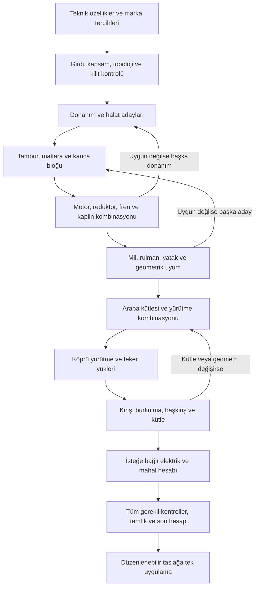

# Hesap raporunda hızlı otomatik seçim — araştırma ve uygulama planı

Tarih: 08.09.2026 · İncelenen başlangıç commit'i: `3ed89a4`

09.09.2026 ikinci denetimi: Uygulamada yeniden üretilebilen hatalar ve açık çıkış ölçütleri için [10–15 numaralı tamamlama fazları](HIZLI_OTOMATIK_SECIM_EK_FAZLAR.md) eklendi.

Durum: **08.09.2026 tarihindeki araştırma ve tasarım kaydıdır.** Ardından uygulama yapıldı. Güncel yazılım kapsamı, gerçek katalog ölçümleri, veritabanı doğrulamaları ve henüz dış mühendislik verisi gerektiren maddeler [uygulama ve doğrulama notunda](HIZLI_OTOMATIK_SECIM_UYGULAMA.md) bulunur. Aşağıdaki canlı verinin okunmadığına ve performansın ölçülmediğine ilişkin cümleler ilk araştırma anını anlatır; güncel durum değildir.

## 1. Önerilen karar

Mevcut hesap motorunun üzerine, kullanıcının isteğiyle bir kez çalışan, kuralları açıklanabilir bir **ekipman seçme ve tasarım tamamlama katmanı** kurulmalı. Kullanıcı teknik özellikleri girer; başlığın yanındaki **Hızlı otomatik seçim** düğmesinden ana markaları seçer; **Hesap raporunu oluştur** dediğinde sistem uyumlu kombinasyonu hesaplar ve düzenlenebilir rapor taslağına uygular.

Hesap doğruluğunun tek kaynağı mevcut `runCalc` ve ortak mühendislik fonksiyonları kalmalı. Seçim katmanı aday üretir, türetilen girdileri günceller, hesaplatır, başarısız kombinasyonları eler, gerektiğinde önceki seçime dönerek başka kombinasyon dener. Ekranda gerçekten tıklayan bir robot veya her çalıştırmada mühendislik kararını bir dil modeline bırakan çözüm bu iş için uygun değil. Kullanıcının işlem sırası kod içinde açıkça modellenmeli.

**Optimumun tanımı:** seçilen markalar, onaylı katalog sürümü, tasarım profili ve zorunlu teknik şartlar içinde; uyumlu, yeterli, imal edilebilir ve gereksiz büyütülmemiş kombinasyon. İlk sürümde maliyet verisi yoksa “en ucuz” iddiası kurulmaz. Sınırlı arama tamamlanmadıysa “bulunan en iyi uygun kombinasyon” denir; küresel optimum kanıtlandığı söylenmez.

**Tam hedef ile ilk teslim ayrılmalı.** İlk teslim, belirli vinç ailelerinde ana mekanik ekipmanları güvenilir biçimde seçer. Sadece teknik özelliklerden geometri, kiriş ve kütleleri de üreten tam kapsam, ayrıca doğrulanmış tasarım aileleri gerektirir. Bu aşama yol haritasının zorunlu parçasıdır; tek tek katalog seçimiyle bitmiş sayılmaz.

## 2. Araştırma kapsamı ve güven sınırı

İnceleme üç paralel eksende yapıldı: hesap ve bağımlılıklar; teklif/mühendislik entegrasyonu; katalog ve veri yeterliliği. Ayrıca üst klasördeki FEM, CMAA ve Flender PDF'lerinin ilgili sayfaları tekrar okundu; seçilen kritik sayfalar görüntü olarak kontrol edildi.

Başlıca incelenen kaynaklar:

- `AGENTS.md`; `docs/agent/hesap.md`, `teklif.md`, `katalog.md` ilgili kuralları.
- `src/lib/calc/engine.ts`, `types.ts`, `derive.ts`, `defaults.ts`, mekanik modüller ve mevcut yardımcı seçiciler.
- `src/lib/revision-load.ts`, ortak revizyon editörü, modül adaptörleri, kayıt/yayın eylemleri.
- `src/lib/catalog-mapping.ts`, katalog arama ve seed yolu; üst klasördeki `catalog_data`.
- Teklif teknik veri devri, teklif maliyet modeli, rapor bağlamı ve ilgili migration'lar.
- Ağırlık dökümü ile hesap motoru arasındaki mevcut sınır.
- `docs/standards/` notları; bunlar tarihsel araştırma kaydı olarak kullanıldı. Eski notlardaki her açık konu güncel kod hatası kabul edilmedi.

Mevcut altyapının temel davranışı için 8 test dosyasında **228 test geçti**: `engine.integration`, `derive`, `topology`, `auto-fields`, `double-drum`, `trolley-only`, `ground-crane`, `cmaa-factors`. Bu yalnız mevcut altyapının başlangıç doğrulamasıdır; yeni seçim algoritması henüz yoktur.

Katalog sayıları **yerel dosyalardan ve seed dönüşümünden** ölçüldü. Canlı Supabase katalog satırları, etkinlik durumları, RLS politikalarının canlı kurulumu ve gerçek müşteri raporları bu çalışmada sorgulanmadı. Verilen erişim anahtarı kullanılmadı ve dosyalara yazılmadı. Faz 0'da yerel/canlı katalog farkı salt okunur denetimle kapanmalı.

Ayrıntılı yardımcı araştırma dosyaları bu planın sonundadır. Bu belge, o bulgular arasındaki tasarım kararlarını ve uygulama sırasını birleştirir.

## 3. Mevcut yapının sağladıkları ve kapatılması gereken boşluklar

| Konu | Bugünkü durum / kanıt | Yeni özellik açısından karar |
|---|---|---|
| Ortak motor | `engine.ts:563` `runCalc`; HESAP-31 aynı `RevisionEditor` ve snapshot zincirini tarif ediyor | Teklif ve mühendislik için tek seçim çekirdeği |
| Otomatik girdiler | `derive.ts` ve editör/adaptörlerde türetmeler var | Ekrandan bağımsız ortak normalizasyon; her adaydan sonra aynı sıra |
| Başarı göstergesi | `engine.ts:714` yalnız üretilmiş kontrollerde `every(pass)` | Beklenen alan ve kontroller için ayrıca tamlık/kapsam doğrulaması |
| Katalog seçimi | Bazı eksik ürün özellikleri eşlemede atlanıyor, önceki seçimden değer kalabiliyor | Ürün alanlarını sahiplik grubuyla tamamen değiştir; eksik alanı eski üründen tamamlama |
| Şablon | Yeni rapor gerçek sayılar/seçimler içeren şablondan açılıyor | Şablon değeri ile bu iş için doğrulanmış seçim ayırt edilmeli |
| Topoloji | `activeModules`, `moduleAllowedByConfig`, `MODULE_PARENT` mevcut | Yeni motor kendi modül listelerini kopyalamamalı |
| Alt bölüm gizleme | HESAP-7: görünümden çıkar, hesapta kalır | Gizleme başarısız teknik kontrolü ortadan kaldırmamalı |
| Ağırlık | Teknik özellikte girdi; döküm ayrı doğrulama, HESAP-35 | İlk aşamada girilmiş kütle sabit; sonraki aşamada açık, tek seferlik tasarım/kütle çözümü |
| Teklif devri | HESAP-39: tekliften yalnız dar teknik beyaz liste aktarılır | Teknik devir, ekipmanın seçilmiş olduğu anlamına gelmez |
| Teklif maliyeti | `offers/cost/model.ts` ayrı tahmin modeli | Bu modelin motor gücü/kesit tahminini hesap raporuna kaynak yapma |
| Revizyon kaydı | Ortak save yolu JSON'u yeniden kuruyor; yeni metadata kendiliğinden korunmaz | Provenance, kilit ve çalışma kaydı için açık okuma/yazma sözleşmesi |
| Eşzamanlılık | İncelenen kayıt yolunda beklenen sürümle koşullu güncelleme yok | Seçim ve kayıt öncesi kaynak sürümü kontrol et; başka düzenlemeyi ezme |
| Yetki | Bağlama göre yazma yetkisi değişiyor; salt okunurluk sadece issued kontrolüne bırakılamaz | Düğme, sunucu ve RLS aynı bağlam/yetki sorusunu kullanmalı |

### Özellikle önemli dört bulgu

1. **Parçalar tek tek en küçük seçilemez.** Daha küçük motorun devri veya mili farklı olabilir; redüktör, kaplin ve gerçek hız değişir. Daha küçük halat farklı tambur/makara/kanca bloğu ve kütle yaratır. Yerel olarak küçük parça, bütün sistemde büyük veya uyumsuz seçim doğurabilir.
2. **Boş veri başarı değildir.** Bazı opsiyonel ekipmanlarda veri olmadığında kontrol üretilmiyor. Yeni sistem “kontrol yok” ile “uygun” durumlarını ayırmadan güvenilir olamaz.
3. **Fiziksel yokluk ile gizleme farklıdır.** Kullanıcı bir bölümü müşteriye göstermemek için gizleyebilir. O ekipmanın kütlesi ve taşıdığı yük fiziksel modelden bu yüzden düşemez. Gerçekten bulunmayan ekipman için açık uygulanabilirlik/topoloji kararı gerekir.
4. **Teklif ekranına bağlantı ayrı iştir.** Teklif Hesap Raporları arşivi ile müşteri teklifindeki teknik kalem/BOM arasında kimlikli, revizyonu sabitlenmiş aktarım ayrıca kurulmalı.

## 4. Kullanıcı akışı

### 4.1 Başlangıç

Teknik özellikler bölüm başlığı:

`01 · TEKNİK ÖZELLİKLER                         [Hızlı otomatik seçim]`

Düğme yeni raporda ve düzenlenebilir mevcut taslakta bulunur. Yayımlanmış raporda seçim yapmaz; mevcut yeni revizyon akışına yönlendiren açıklama gösterir. Kullanıcının ilgili bağlamda düzenleme yetkisi yoksa eylem açılmaz.

### 4.2 Tek pencerede hızlı seçim

Pencere başlığı **Hızlı hesap raporu oluştur**. Üstte girilmiş kapasite, hızlar, açıklık, sınıflar ve vinç düzeni kısa özeti bulunur. Zorunlu bir teknik alan eksik/çelişkiliyse ilgili satıra doğrudan bağlantı gösterilir. Normal durumda kullanıcıya tekrar aynı teknik alanlar sorulmaz.

| Hızlı karar | Davranış |
|---|---|
| Motor markası | Varsayılan ortak; gelişmiş alanda kaldırma/yürütme veya eksen bazlı ayrılabilir |
| Redüktör markası | Kaldırma ve yürütme için iki seçim; farklı ürün ailelerine izin verir |
| Servis freni markası | Teknik özellikteki fren tipiyle uyumlu üreticiler |
| Motor-redüktör kaplini | Ayrı marka; fren kasnağı/diskli tip teknik ihtiyaca göre süzülür |
| Tambur kaplini | Ayrı marka; motor kapliniyle aynı aile varsayılmaz |
| Rulman markası | Mevcut vinç genelindeki marka ve yerel istisna davranışına bağlanır |
| Halat, tampon, emniyet freni | Yalnız ilgili ekipman varsa; ana ekranı kalabalıklaştırmayan ek tercihler |
| Tasarım profili | Onaylı aileden gelir; kullanılan kabuller kısa özetle görülebilir |
| Mevcut seçimleri koruma | Önceki kullanıcı seçimleri/elle düzenlenen alanlar varsayılan olarak korunur |

Marka seçenekleri onaylı ve uygulanabilir katalogdan üretilir. Listede bulunmak tek başına eksiksiz otomatik seçim desteği anlamına gelmez: örneğin “termik verisi eksik” durumu görünür olmalı. “Fark etmez” bilinçli bir seçenek olabilir; başka marka kullanma izni varsayılan olarak kapalı kalır. İzinli alternatif varsa kullanıcı aynı pencerede sırasını belirler.

Alt eylem **Hesap raporunu oluştur**. Bu eylem belirlenen kapsamı hesaplamak ve başarılı sonucu açık taslağa uygulamak için yeterlidir. Her başarılı çalışmadan sonra ikinci bir zorunlu onay penceresi açılması önerilmiyor.

### 4.3 Çalışma ve sonuç

- İlerleme gerçek aşama adlarıyla gösterilir: “Kaldırma donanımı”, “Motor ve redüktör”, “Yürütme”, “Son kontroller”. Gerçek ölçüm yoksa sahte yüzde verilmez.
- İptal, çalışma kopyasını bırakır; mevcut rapor seçimlerini bozmaz. Arka plandaki hesap ana ekranı dondurmaz.
- Tam ve tutarlı sonuç editöre **tek işlemle** uygulanır; mevcut kaydetme/yayınlama düzeni sürer. Kullanıcı **Geri al**, **Seçim gerekçeleri** ve değişen bölümlere erişir.
- Sayısal seçim tamamlanmış fakat mühendisin gerçek ölçü teyidi bekleniyorsa tutarlı taslak yine aynı eylemle uygulanabilir; durum **Taslak hazır — ölçü onayı bekliyor** olur. Ölçü onayları otomatik verilmez, ilgili engelleyici kontroller görünür kalır ve rapor yayınlanabilir sayılmaz. Bu durum eksik ürün/geometri verisinden ayrı değerlendirilir.
- Başarılı özet, örneğin hangi ekipmanların seçildiğini, gerçek hızları, kritik kullanım oranlarını ve profil kabullerini gösterir. Gerçek veri oluşmadan örnek ürün/güç isimleri sunulmaz.
- Kısmi sonuçta “rapor tamamlandı” yazmaz. Geçerli bağımsız gruplar ayrı öneri olarak tutulabilir; kullanıcı yalnız tutarlı grupları uygulayabilir. Bağımlı bir zincirin yarısı kendiliğinden mevcut rapora karıştırılmaz.
- Uygun aday yoksa neden somut olur: “Seçilen markada bu çıkış mili ve gerekli momenti birlikte sağlayan doğrulanmış ürün yok.” Kullanıcı marka, kilit veya teknik kısıtı bilinçli değiştirir.
- Sonraki elle düzenleme ilgili seçimi kullanıcıya ait yapar. Etkilenen alt seçimler “yeniden kontrol gerekli” olur; sistem düğmeye yeniden basılmadan bunları başka ürünle değiştirmez. Mevcut formül türetmeleri çalışmaya devam edebilir.

## 5. Sadece teknik özellikler yeterli olacak mı?

**Desteklenen ve mühendislik kuralları tanımlanmış vinç ailesinde evet. Mevcut veri modelinin bütün kombinasyonları için bugün henüz değil.** Eksik bilgiler üç grupta çözülmeli:

| Bilgi türü | Çözüm | Örnek |
|---|---|---|
| Müşterinin gerçek şartı | Teknik özellikte bulunur; eksikse tamamlanır | Kapasite, hız, çalışma sınıfı, sıcaklık, açıklık, besleme |
| Hesapla belirlenen boyut/seçim | Aday araması üretir, hesap motoru doğrular | Halat çapı, tambur, motor gücü, teker çapı |
| Tasarım yaklaşımı / imalat kararı | Sürümlü, mühendisçe doğrulanmış aile profili | Donanım alternatifleri, mil malzemesi, imal edilen çap/sac serileri, yerleşim sınırları |

Kullanım ve mekanizma sınıfları yalnız tonajdan çıkartılmaz. Yardımcı kaldırma ve yürütmelerin kendi sınıfları korunur; eski revizyon fallback'leri yeni projede sessiz kabul yapılmasına gerekçe oluşturmaz. FEM mekanizma sınıfı ile CMAA uygulama sınıfı arasındaki firma eşlemesi, birebir standart eşdeğerliği diye gösterilmez.

Teknik özelliklere/profil modeline şu eksikler kapsamına göre eklenmeli: yük kolektifi ve çevrim bilgisi, ED ve kalkış sıklığı, rakım, frekans/sürücü çalışma aralığı, malzeme/tutucu tipi ve gerçek tutucu kütlesi, geometrik yerleşim sınırları, açık saha rüzgâr tasarım verileri. Her kullanıcıya hepsi sorulmaz; seçilen aile ve işletme şartı neyi gerektiriyorsa o açılır.

Profilin sayısal alanları geçmiş bir rapordan kör kopya değildir. Her alanın kaynağı, kullanılabildiği tonaj/açıklık/sınıf/sıcaklık/topoloji sınırı ve doğrulanma durumu bulunur. Bilinmeyen değer `0`, `1` veya başka ürünün değeriyle doldurulmaz.

### Ağırlık ve geometri için iki aşama

**İlk mekanik sürüm:** kullanıcının teknik özellikte verdiği araba/köprü kütleleri sabit girdidir. Girilmemiş kütle gereken yürütme/yapı zincirini durdurur. Kaldırma gibi bağımsız hazırlanabilen alanın sonucu ayrı üretilebilir.

**Tam hedef:** aile profili, kanca/tahrik/şasi/kiriş boyutlarından bir kütle modeli kurar; katalog ağırlıklarıyla günceller; yürütme ve yapıyı yeniden çözer. Kullanıcının girdiği kilitli ağırlık değiştirilmez. Ağırlık önerisinin teknik özelliğe yazılması düğmeyle başlatılan tek çalışma/uygulama işleminin açık parçasıdır; sürekli sessiz `*Auto` yazımı değildir.

Mevcut ağırlık dökümü doğrudan çözücüye geri beslenmemeli: kimi kalemler tahmini/eksik ve görünümde gizlenebilir. Fiziksel kütle modeli, parça varlığını/topolojiyi esas almalı; eksik kilo varsa toplamın yalnız alt sınır olduğu bilinmeli. Alt sınırla yürütme veya taşıyıcı yapı “uygun” onayı verilmez. Muhafazakâr bir üst sınır kullanılacaksa geçerlilik alanı mühendislik verisiyle kanıtlanır, hassasiyet analizi yapılır ve sonuç ön tasarım olarak işaretlenir.

Teklif maliyet modelinin ampirik sonuçları hesap girdisi olmaz. Onaylı ortak imalat tabloları kullanılabilir; yeni teknik tahmin profilleri ayrıca versiyonlanır. Kaynak HESAP-35 ve MALIYET-3 sınırı korunur.

## 6. Hesap ve seçim sırası



Bu çizim ana akıştır; bağımsız kaldırmalar kendi zincirlerinde paralel çözülebilir. Paylaşımlı arabada ana ve yardımcı donanım kütleleri birleştirilmeden yürütme tamamlanmaz. Köprü her iki taraftaki etkileri ve doğru eşzamanlı yük senaryolarını bekler.

| Adım | Üretilecek aday/karar | Yeniden kontrol gerektiren bağımlılık |
|---|---|---|
| 0 | Etkin modüller, güvenlik düzeni, bağımsız mekanizmalar, yük senaryoları | Topoloji değişince tüm ilgili alt dallar |
| 1 | Onaylı halat donanımları, halat yapı/mukavemet/çapı | Kol sayısı, verim, halat/tutucu kütlesi, tambur kapasitesi |
| 2 | Tambur halat ekseni çapı, yiv adedi/boyu, et kalınlığı, makara çapı | Moment, gerçek donanım uzunluğu, mil reaksiyonları ve yerleşim |
| 3 | Kanca standardı/no/malzeme, kanca bloğu ve denge elemanları | Taşıma kapasitesi, makara/mil/rulman/yatak uyumu |
| 4 | Motor güç/devir/adet + redüktör oran/boyut/montaj | Gerçek hız, mekanik/termik güç, giriş/çıkış momenti, radyal yük |
| 5 | Servis freni ve varsa emniyet freni; kaplinler | Fren torku/enerjisi, hız, mil delikleri, kasnak/disk ve üretici sınırları |
| 6 | İmal edilebilir mil çapları/oturmalar, rulman/yatak | Statik ve ömür hesabı, malzeme, geometrik çakışma |
| 7 | Araba teker/ray/sertlik/adet/tahrik düzeni | Yük dağılımı, temas, teker mili, yürütme momenti, fren/tampon |
| 8 | Köprü teker/tahrik/yürütme, ölçü zinciri | Araba konumları, toplam kütle, savrulma, yol kirişine kuvvetler |
| 9 | Onaylı kesit ailesinden ana/ikinci kiriş ve başkiriş | Gerilme, yorulma, sehim, yerel teker basıncı, burkulma, kütle |
| 10 | Etkinse sürücü/kablo/feston, pano/mahal klima ön seçimi | Motor listesi, yerleşim, ısı yükü, kablo mesafeleri ve besleme |
| 11 | Tüm rapor için son normalizasyon ve `runCalc` | Hiçbir nihai çıktı önceki adayın hesap sonucundan kalamaz |

Donanım/topoloji tek kaynakları (`reeving`, `MODULE_PARENT`, `activeModules` vb.) kullanılmalı. `validateReeving` gibi mevcut doğrulayıcılar aday girişinde çalışmalı. Alt donanım adedini motor gücü yeterli olsun diye keyfî artırmak veya güvenlik frenini kaldırmak arama hamlesi olamaz.

### Döngülerin çözümü

- **Halat–kütle–donanım:** yeni halatın metre ağırlığıyla yük yeniden hesaplanır; gerekirse aynı aday grubunda bir üst çap/donanım denenir.
- **Motor–redüktör–hız:** güç, gerçek devir, oran ve tambur/teker çapı bir kombinasyon olarak değerlendirilir. Fren ve kaplin eklendikten sonra kombinasyon yeniden doğrulanır.
- **Mil–rulman–yerleşim:** yalnız büyük rulmana geçmek yeterli olmayabilir; daha büyük gövde reaksiyon kolunu değiştirebilir. Uyumlu standart ölçü paketleri denenir.
- **Kütle–yürütme–kesit:** kiriş/ekipman büyüdüğünde kütle ve teker yükleri güncellenir. Aynı aday durumuna dönülürse çevrim saptanır; sonsuz döngüye girmez.

Her döngüde son durum özeti, aday sayısı ve yakınsama koşulu tutulmalı. Sayısal yakınsama tek başına yetmez: son kütle/ölçülerle bütün kontroller tekrar geçmeli. Yakınsamayan veya arama bütçesi biten çalışma tamamlanmış sayılmaz.

## 7. Optimizasyon yöntemi

İlk öneri, deterministik aday üretimi + kısıt elemesi + sınırlı geri izleme. Küçük aday kümelerinde tam tarama; büyük kümelerde güvenilir alt sınırlarla eleme ve umut verici birkaç kombinasyonu birlikte tutan arama. Başlangıçta haricî genel optimizasyon altyapısı zorunlu değil; gerçek aday hacmi ve ölçülen süre gerektirirse ayrı karar verilir.

**Önce zorunlu şartlar:** standart ve üretici yeterliliği, kullanıcı şartnamesi, topoloji, ürün kullanım alanı, marka/kilit sınırları, birim ve veri tamlığı, montaj ve gerçek hız. Bu şartlar puanlama uğruna gevşetilmez.

**Sonra sıralama:** onaylı ORION tasarım profiline uygunluk, yeterli tasarım payı, gereksiz büyük güç/boyut/kütleden kaçınma, imalat ve yedek parça standardizasyonu, eşit adaylarda sabit varyant anahtarı. Güvenlik payının hedef aralığı tasarım profiline aittir; bu belgede normatifmiş gibi evrensel yüzde önerilmez.

**Fiyat/termin daha sonra:** yalnız mevcut, tarihli ve aynı kapsam/para birimi için karşılaştırılabilir verilerle sıralamaya eklenir. Eksik fiyat `0` olamaz. Mühendislik rolüne ticari veri açılmaz; hesap çekirdeği maliyet servisini çağırmaz. Teklif bağlamında yetkili ticari sıralama ayrı adaptör olabilir.

Her seçimin açıklaması en az şu dört soruyu cevaplar: hangi talebi sağlıyor, hangi kısıt belirleyici oldu, daha küçük/yakın aday neden elendi, hangi profil/katalog sürümüne dayanıyor? Açıklamalar karar kodlarından üretilir; serbest ve doğrulanamayan metinle uydurulmaz.

**Arama doğruluğu:** mevcut picker'ın kapasite filtresi ve “en yakın 10 oran” listesi çözücü havuzu olarak kullanılamaz. İlk 10 içinde uygun paket bulunmaması diğer ürünlerin de uygunsuz olduğu anlamına gelmez. Eleme işlemlerinin güvenli olduğu kanıtlanmalı; küçük örnek uzaylarında tam taramayla kıyaslanmalı.

**Durdurma sonucu:** `complete`, `readyForReview`, `partial`, `blocked`, `cancelled`, `budgetExceeded`, `stale` ayrı anlam taşır. `readyForReview`, sayısal/verisel kapsamı tamamlanmış fakat açık insan teyidi bekleyen tutarlı taslağı ifade eder; “bütün kontroller geçti” anlamına gelmez. Bütçe biterse bulunan geçerli aday açıklanabilir; optimum kanıtı ve tam kapsam iddiası verilmez. Aynı veri ve aynı deterministik aday bütçesi aynı sonucu üretmeli; donanıma bağlı süre sınırının erken durdurduğu sonuç ayrıca işaretlenmeli.

## 8. Katalog hazırlığı

Yerel seed dönüşümünden elde edilen sayılar:

| Aile | Yerel aday satırı | Otomatik seçim açısından durum |
|---|---:|---|
| Motor | 480 | Güç/devir/mil var; gerilim/frekans/görev/montaj gibi sipariş-uygunluk alanları ayrıca tamamlanmalı |
| Redüktör | 62.427 | 31.759 kaldırma, 30.668 yürütme varyantı; her satır aynı yeterlilikte değil |
| Halat | 7.079 | 5.551 vinç kullanımı; uygulama ve yapı filtresi gerekir |
| Fren | 139 | Tork tek başına yeterli değil; mekanik/termik/montaj koşulları |
| Kaplin | 588 | Motor kaplini/tambur kaplini aileleri ve delik/şaft/geometri uyumu |
| Rulman / yatak | 441 / 28 | Ölçü, statik/dinamik kapasite, hız, yatak eşleşmesi |
| Teker / makara / kanca | 11 / 13 / 22 | Jenerik veya standart boyutlar; uygunluk motorun standart hesabıyla belirlenir |
| Tampon | 151 | Enerji, strok, kuvvet ve çarpma senaryosu birlikte |

62.427 redüktör satırının yalnız 20.113'ünde çıkış mili, 18.923'ünde giriş mili, 14.373'ünde termik güç alanı mevcut. Bunlar alanın dolu olmasını ölçer; değerlerin her kullanım şartı için doğrulandığı anlamına gelmez. Otomatik seçim için **marka + ürün ailesi + varyant + kullanım koşulu** düzeyinde destek matrisi gerekir.

Ham motor dosyaları 537 satır; seed 480 satırı alıyor. Yereldeki 57 satırlık `sew_drn.json` seed yolunda kullanılmıyor. Ayrıca bazı motor kaynaklarında alternatifler önceden IE/gövde/ağırlık önceliğiyle elenmiş. Bu yüzden katalog evreni ve ön eleme politikası da “optimum” tanımının parçası.

### Zorunlu veri sözleşmesi

- Tek tip birimler; özgün değer ve birim gerektiğinde saklanır. Mevcut motorun kg/cm², kg·cm, kNm ve Nm geçişleri yalnız adaptörlerde açık dönüşümle yapılır.
- Kararlı `variantKey`: marka/model yeterli değil. Motor için güç/kutup/devir ve ürün varyantı; redüktör için oran/giriş devri/kullanım/montaj gibi ayrıştırıcılar gerekir.
- Katalog ID'si yanında kaynak belge, baskı/sayfa, çıkarım sürümü, doğrulayan kişi/durum, içerik özeti ve gerekli teknik değerlerin snapshot'ı bulunur. Yeniden seed edilen UUID, tek başına tarihsel kanıt olamaz.
- Kritik alan eksikse aday `needsManufacturerData` olur. Başka ürünün değerleri veya genel varsayılan ile “doğrulanmış” aday yapılamaz.
- Üretici aile kuralı birden fazla ürün için kanıt sağlıyorsa o kural ayrı kaynaklı ve sürümlü olarak uygulanır; her satıra aynı sayı kör yazılmaz.
- Kesin olmayan/dönüştürülemeyen değerler, teknik eşik yakınındaki yuvarlama belirsizlikleri ve PDF tablo kaymaları açıkça işaretlenir.
- Tedarik durumu doğrulanmamışsa “stokta/temini kolay” puanı verilmez. Pasif ürün yeni seçimden elenir, eski snapshot'ın okunması korunur.

**Ray için kaynak kararı:** ham `catalog_data/rails/standard.json` ile motorun `tables.ts` defteri aynı değil. Çalışan motorun 31 seçenekli `RAILS` defteri ortak teknik kaynak olmalı; A55 ağırlığında iki yerdeki fark gibi uyuşmazlıklar veri denetiminde kapatılmalı. Jenerik teker `max_load_kN` alanı FEM ray-temas hesabının yerine geçmez.

### Ürün değişiminde sahiplik

Bir ürün grubu seçildiğinde o grubun model, marka, katalog kimliği ve kapasite/ölçü alanları birlikte değiştirilir. Korunacak kullanıcı sipariş tercihleri (örneğin koruma sınıfı) ürün niteliklerinden ayrı tutulur. Kullanıcının koruduğu montaj veya delik ölçüsü yeni ürüne uymuyorsa çelişki gösterilir; iki üründen hibrit kayıt üretilmez.

## 9. Standart araştırmasından tasarıma yansıyan kararlar

Sayfa numaraları aksi yazılmadıkça PDF'in 1 tabanlı sayfa sırasıdır. Buradaki özetler formül uygulaması için kaynak metnin ve dipnotlarının yerini tutmaz.

| Kaynak | Tekrar bakılan bölüm | Plana etkisi |
|---|---|---|
| FEM 1.001, yerel PDF | 175–178; basılı 4-17…4-20; 4.2.2 ve 4.2.3 | Halat emniyeti ve tambur/makara çapı mekanizma sınıfı/donanıma göre seçilir |
| FEM 1.001, yerel PDF | 179; basılı 4-21; 4.2.3.3 ve 4.2.4 | Halat uç bağlantısı ve tamburda kalan sarım; teker seçimi yük+ray+malzeme+devir+sınıfla yapılır |
| CMAA 70, yerel 1983 baskısı | 39; basılı 37; 4.8 ve 4.9.1 | Rulman ömrü ve fren düzeni; tek tork alt sınırı tüm fren yeterliliği değildir |
| CMAA 70, aynı baskı | 57–58; basılı 55–56; 5.2.9 | Motor için mekanik güç yanında kontrol, sıcaklık ve görev/termik etkiler değerlendirilir |
| CMAA 70, aynı baskı | 62–63; basılı 60–61; 5.2.10 | Gerçek motor devri ve gerçek yükte hız; yalnız teorik tahvil oranı yeterli değil |
| Flender MD20.1, 2018 | 49; basılı 3/9 | Seçilmiş redüktörün termik kapasitesi ayrıca kontrol edilir; soğutma seçeneği sonucu değiştirir |
| Flender MD20.1, 2018 | 53; basılı 3/13 | Ürün ailesine bağlı yük kolektifi/ömür/servis faktörleri ve özel boyut-oran istisnaları |

**Gerçek hız ayrı kısıt olmalı.** Güncel `hoistGroup.ts:1578` civarındaki oran sapma bandı `-10…+5%` firma uyarısıdır. Oranın gerekli oranın %90'ı olması gerçek hızı yaklaşık %11,11 artırır. Yerel CMAA baskısının 5.2.10.3 maddesi gerçek tam yük hızındaki sapmayı ele alır. Dolayısıyla oran uyarısını geçen adayın müşteri hız şartını sağladığı varsayılamaz; hedef hız ve seçilen standarda/projeye göre gerçek hız sınırı ayrıca uygulanmalı.

**Üretici faktörleri ayrıdır.** Flender'ın vinç uygulaması açıklaması yük kolektifi ve çalışma süresini kullanır; yalnız M sınıfından gelen tek genel katsayının bütün marka/seriler için yeterli olduğu kabul edilemez. Kaynak: [Flender resmî MD20.1 kataloğu](https://www.flender.com/en/media-download/media/MD21_1_FZG_CATALOG). Termik güç ve soğutma kararı da aynı üretici katalog yönteminin ayrı adımıdır.

**Baskı sabitlenmeli.** FEM resmî rehberi 1.001'i 1998 tarihli yayın olarak listeliyor: [FEM teknik yayınları](https://fem-eur.com/technical-guidance/). Yerel CMAA PDF'i 1983 baskısıdır; sonraki baskılardaki madde numarası ve koşullar bununla otomatik eşit sayılmaz. MHI'nin [CMAA güncelleme açıklaması](https://mhiblog.org/updated-specifications-for-overhead-cranes-in-development/) de teknik bölümlerin değiştiğini gösterir. Projeye uygulanacak standardın baskısı, şartname ve yöntem profiline kaydedilmeli; yeni baskıya geçiş ayrı doğrulama işi olmalı. Bu çalışma güncel baskıların tamamına uygunluk denetimi değildir.

**Mevcut kapsam sınırı korunmalı.** `buckling.ts:434` civarında rüzgârlı Durum II açıkça kapsam dışı ve bilgilendirme kontrolü `pass: true`. Otomasyon bunu “açık saha yapı hesabı tamam” diye yorumlayamaz. `installationEnvironment` alanının bulunması mekanik rüzgâr modelinin bulunduğu anlamına gelmez. Açık saha/portal gibi aileler gerekli yükler ve stabilite kontrolleri doğrulanana kadar tam otomatik yapı kapsamına alınmaz.

DIN kanca/yiv/mil/yorulma referansları uygulamada mevcut; bu turda bütün DIN belgelerinin asıl metinleri tekrar okunmadı. Faz 0 kural defteri denetimi, yeni seçime karar verdiren her maddenin kaynak sayfasını ve geçerlilik sınırını ayrıca sabitlemeli.

## 10. Teknik mimari

Önerilen yeni saf alan: `src/lib/auto-selection/`. `lib/calc` fizik ve kontrollerin kaynağı olmaya devam eder. UI, veritabanı erişimi ve ticari veriler saf alana girmez.

```text
Teknik özellikler + mevcut CalcInput + kullanıcı kilitleri
            + sürümlü profil + onaylı katalog görüntüsü
                              |
                 ortak durum normalizasyonu
                              |
       aday üret -> sıkı ürün eşle -> hesapla -> ele/sırala
                              |
          tamlık + bağımlılık + nihai hesap doğrulaması
                              |
    SelectionProposal (değişiklikler, gerekçeler, eksikler, iz)
                              |
       ortak editöre tek uygulama -> mevcut taslak kaydı
```

### 10.1 Modül ayrımı

| Önerilen modül | Sorumluluk |
|---|---|
| `types.ts`, `schema.ts` | İstek, sonuç, kapsam, kilit, kaynak, karar kodları; çalışma zamanı doğrulaması |
| `normalize.ts` | Ortak türetme sırası, aktif topoloji, bayrak/override davranışı; editörle aynı |
| `requirements.ts` | Hesap sonuçlarından aday talebi; gerekli alan ve kontroller |
| `catalog.ts`, `catalog-adapters/` | Salt veri olarak gelen doğrulanmış ürün varyantları; sıkı eşleme |
| `profiles.ts`, `rules/` | Sürümlü mühendislik aileleri, geçerlilik sınırları, üretici istisnaları |
| `solvers/hoist.ts`, `travel.ts`, `structure.ts` | Bağımlı aday grupları ve geri izleme |
| `search.ts`, `ranking.ts` | Arama bütçesi, güvenli eleme, kararlı sıralama |
| `completeness.ts`, `validate.ts` | Beklenen kapsam, eksik kanıt, son doğrulama |
| `patch.ts`, `provenance.ts` | Değişecek alanlar, sahiplik, gerekçeler, çalışma kaydı |
| Worker adaptörü | İlerleme, iptal, UI'dan ayrılmış hesap; çekirdeği değiştirmez |
| Sunucu katalog/uygulama adaptörü | Yetki, sayfalama, sürüm ve katalog doğrulama; HTTP/DB bu sınırda |

Fizik formülleri bu klasöre kopyalanmaz. Eksik bir fizik kontrolü gerekiyorsa önce mevcut hesap çekirdeğine kaynağıyla eklenir; manuel rapor da aynı iyileştirmeden yararlanır. Sunum amaçlı `cells` alanları kullanılacaksa sabit sözleşmesi ve kapsam testi bulunur; ekrandaki Türkçe etiketler parse edilmez.

### 10.2 İstek ve sonuç sözleşmesi

İstek en az `input`, `scope`, `brandPreferences`, `locks`, `profileId/version`, `catalogFingerprint`, `sourceRevisionId`, `sourceStateHash`, `searchBudget` taşır. Şablondan gelen alanların kaynağı ayrıca bilinir.

Sonuç en az `status`, `proposedInput`, `patch`, `result`, `coverage`, `decisions`, `unresolved`, `assumptions`, `searchSummary` ve sürümleri taşır. `coverage`, aktif bölüm başına gerekli kararların tamamlanıp tamamlanmadığını ve hangi ölçütlerin değerlendirilmediğini gösterir.

Kontrol değerlendirmesi en az **uygun / yetersiz / veri eksik / uygulanamaz** durumlarını ayırmalı; hesap istisnası da veri eksikliğine dönüştürülüp gizlenmemeli. `uygulanamaz` açık gerekçe taşır. Eski `AnyCheck` snapshot'ları geriye uyumlu okunabilir; yeni tamlık katmanı eski raporları açarken kendiliğinden değiştirmez.

**İnsan teyidi ayrı bir eksendir.** Mevcut `wheelLoads.measurementsConfirmed` ve `girder.loadMeasurementsConfirmed` gibi ölçü teyitleri arama değişkeni değildir; çözücü bunları `true` yapamaz. Karar manifest'i sayısal/ürün uygunluğunu gerçek ölçü teyidinden ayırmalı, `reviewPending` listesi tutmalıdır. Sayısal/verisel koşullar eksiksizse `readyForReview` taslağı üretilebilir; eksik termik/mil/geometri verisi bu sınıfa gizlenemez. Son raporda gerçek kontrol değerleri ve başarısız teyitler korunur.

### 10.3 Manuel koruma ve tek seferlik çalışma

- Alan kaynakları: `template`, `user`, `derived`, `catalog`, `designProfile`, `autoSelection`; belirsiz eski kayıtta `legacyUnknown`.
- Mevcut `*Auto` bayrakları sürekli türetilen alanlar içindir. Bunlar ürün seçim kilidi değildir; ayrı semantik gerekir.
- Eski raporun elle seçilmiş olabilecek ürünleri varsayılan korunur. Kullanıcı tekrar seçim yapılacak grupları pencerede açar. Yeni raporun şablon ürünleri, doğrulanmış kullanıcı seçimi diye kilitlenmez.
- Kilit grupları yalnız tek sayı değil, ürün kimliği ve ona ait kapasite/ölçü alanlarını kapsar. Bir ürün kilitliyse marka değişikliği onunla çelişebilir; çelişki açık gösterilir.
- Üst girdi değişince bağımlı otomatik kararların doğrulaması geçersizleşir. Sonraki tuş basışında ilgili dallar yeniden aranır; bağımsız/korunan dallar tutulur.
- Geri alma son otomatik yamanın tersi olarak çalışır. Kullanıcı daha sonra alanı değiştirdiyse bütün eski snapshot'ı kör geri yükleyip yeni düzenlemeyi silmez; çakışan alanı ayırır.

### 10.4 Kayıt, izlenebilirlik ve eşzamanlılık

İlk uygulama için raporun mevcut JSONB snapshot'ına sürümlü `autoSelection` metadata eklemek yeterli olabilir; okuma, kaydetme, kopyalama, revizyon farkı ve dışa aktarım yolu birlikte ele alınmalı. Tam aday havuzu rapora gömülmez; seçilen ürünün gerekli sayıları ve kaynak/fingerprint bilgisi saklanır.

Metadata: seçim motoru sürümü, hesap motoru sürümü, profil ve katalog sürümü, girdinin özeti, zaman/kullanıcı, marka tercihleri, kilitler, seçilmiş varyantlar, belirleyici kontroller, açık kabuller, kapsam ve arama sonucu. Gerekirse ayrıntılı çalışma günlüğü ayrı tabloda tutulur; bu tabloda rapor bağlamıyla aynı RLS uygulanır.

Taslak için monoton `lock_version` veya eşdeğer güvenilir sürüm alanı önerilir. Kaydetme `revisionId + projectId + draft + expectedVersion` koşuluyla atomik yapılmalı. Etkilenen satır yoksa çakışma döner. Eski sonucu otomatik tekrar yazarak çakışma çözülmez. Sürüm yalnız yeni otomatik seçim endpoint'inde değil bütün mevcut yazma yollarında atomik artmalıdır. Issued korumasının geri çekme/şablon gibi dar izin listeleri yeni sürüm alanıyla uyumlu migration içinde güncellenmeli; mevcut yayın koruması gevşetilmemelidir.

Çalışma başında yerel state hash alınır. Kullanıcı hesap sürerken teknik özellik/marka/kilit değiştirirse sonuç `stale` olur ve uygulanmaz. Veritabanında başka kullanıcı değiştirmişse kayıt sırasında ikinci kontrol bunu yakalar. Katalog çalışırken değişirse tek çalışma sabit katalog görüntüsünü kullanır; uygulama/kayıt sırasında değişen kaynak etkisi belirlenen sürüm politikasıyla görünür olur.

Sunucu, istemcinin “başarılı” bayrağına veya gönderdiği kapasiteye güvenmez: payload şeması, seçilen ürünlerin snapshot/kimliği, kapsam, yetki ve son hesap yeniden doğrulanır. Aynı saf doğrulayıcı kullanılır. Yeni çalışma, kaynak izi ve rapor değişikliği birlikte kaydediliyorsa tek işlemde tamamlanır.

Yayımlanmış revizyon güncellenmez. Yeni otomatik taslaklarda engelleyici başarısızlık veya gerekli verinin eksikliği yayın kapısından geçemez; “ön tasarım” kaydedilebilir ve açık durumu korunabilir. Eski taslak/issued davranışına toplu değişiklik ayrı migration/politika kararı gerektirir; otomasyon metadata'sı olmayan eski raporlar sessizce yeniden tasarlanmaz.

**Kaydedilmemiş sonucu yayınlama boşluğu kapanmalı.** Mevcut yayın işlemi son kaydedilmiş sonucu kullanır. Editörde otomatik seçim veya başka düzenleme `dirty` ise yayınlama engellenmeli ya da aynı sürümü doğrulayan `save-then-issue` zinciri kullanılmalı. Kayıt sırasında yapılan daha yeni düzenleme, eski kayıt cevabı gelince temiz/kaydedildi sayılmamalı.

## 11. Teklif entegrasyonu

İki kullanım aynı çekirdeğe bağlanır:

1. Mühendislikte yeni iş kaleminden açılan hesap raporu → teknik özellikler → ortak hızlı seçim.
2. Teklif Hesap Raporları arşivi → aynı editör ve aynı hızlı seçim.

Kullanıcının teklif hazırlama hızını tam karşılamak için üçüncü giriş de gerekir: **teklif teknik kaleminden bağlı ön hesap oluştur/aç**. Bu, `OfferPayload` içine ikinci hesap motoru koymaz; mevcut teklif bağlamındaki `projects/revisions` kaydına kimlikli bağ kurar.

### Bağ ve aktarım

- Teklif kaleminin kalıcı ID'si, kaynak teklif revizyonu ve kaynak hesap revizyonu tutulur. Liste sıra numarasıyla eşleme yapılmaz.
- Bir teklif revizyonunda farklı kalemler ayrı hesap raporlarına bağlanabilir. Aynı donanımın kalem adedi ile rapor içi motor/teker adedi birbirine karışmaz.
- Teknik değerler tek ortak parser ile okunur. `2/8 m/dak`, sayı aralığı, birim dönüşümü ve serbest metin kuralları teklifte/maliyet devrinde/mühendislikte çelişmez.
- Serbest elle yazılmış hücrenin eski gizli `parts` verisi yeni teknik gerçek sanılmaz. Kaynak anlam belirsizse kullanıcıya kalan karar gösterilir.
- Seçim sonucu `buildEquipmentGroups` ve aynı `CalcResult` üzerinden teknik tabloya aktarılır. Motor gücü, adet, marka/model, redüktör, teker çapı gibi mevcut teklif alanlarının açık eşleme sözleşmesi olur.
- Teklifte elle düzenlenmiş teknik hücre varsayılan korunur; kaynak raporla sapma görünür. İstek dışı müşteri şartı değişmez.
- İlk oluşturma akışında “teklif teknik alanlarını sonuçla doldur” aynı başlatma eyleminin kapsamına alınabilir. Sonradan kaynak rapor revizyonu değişince kullanıcıya güncelleme farkı gösterilir; teklif sessizce değişmez.
- Yayımlanmış teklif kaynak hesap revizyonunu, uygulanan teknik snapshot'ı ve içerik hash'ini sabitler. Yalnız `revisionId` yeterli değildir: mevcut rapor geri çekilip aynı V numarası altında değişebilir. Geçmiş müşteri belgesi canlı hesap kaydına join edilerek yeniden doldurulmaz; aynı teknik sayıları taşır.

### Maliyet ve kazanılan iş

Seçilen ekipmanlar maliyet satırlarına ancak yetkili teklif akışından taşınır; fiyat, kur tarihi, termin, opsiyon ve adet ayrı ticari veridir. Maliyet modelinden hesap motoruna ters teknik besleme kurulmaz. Mühendislik teknik devrine fiyat/iskonto/ödeme sızmaz.

İş kazanıldığında teklif ön hesabı kendiliğinden mühendislik raporu olarak yayımlanmaz. Mevcut ayrı arşiv/revizyon kuralıyla kaynak kimliği korunarak mühendislik taslağı açılabilir. Ön tasarım kabulleri ve çözülmemiş konular açık taşınır; mühendis yeni kapsam/saha verileriyle kontrol eder. Bu, aynı motoru kullanırken iki belgenin sorumluluk ve revizyon sınırlarını korur.

## 12. Fazlara ayrılmış uygulama

Fazlar yalnız yazılım ekranlarına göre değil, kapattıkları mühendislik riskine göre bölündü. Sayısal takvim yerine çıkış ölçütleri öneriliyor; katalog doğrulama ve imalat profili çalışmasının süresi gerçek veri denetiminden sonra belirlenmeli.

| Faz | İçerik | Bağımlılık | Çıkış / teslim ölçütü |
|---|---|---|---|
| 0 | Güncel davranış, standart ve destek kapsamı defteri | Başlangıç | Her otomatik karar için kaynak, girdi ve kapsam belli |
| 1 | Katalog normalizasyonu ve üretici kuralları | 0 | Pilot ailelerde gerekli özellikler eksiksiz/doğrulanmış |
| 2 | Ortak normalizasyon, tamlık, kilit ve kayıt altyapısı | 0; 1 ile paralel | UI/çekirdek aynı sonucu üretir; eksik veri başarı olamaz |
| 3 | Kaldırma kombinasyonu çözücüsü | 1 + 2 | Donanımdan fren/kapline tutarlı ana mekanik zincir |
| 4 | Araba ve köprü yürütme çözücüsü | 3; uygun girdili bağımsız parçaları paralel | Teker/ray/tahrik/fren/tampon birlikte doğrulanır |
| 5 | Ortak düğme, marka penceresi ve sınırlı pilot | 2 + 3 + 4 | Mühendislik ve teklif raporu editöründe gerçek tek eylem akışı |
| 6 | Teklif teknik kalemi ve maliyet bağlantısı | 5 | Aynı hesap revizyonundan kayıpsız teknik tablo aktarımı |
| 7 | Geometri, yapı ve kütle döngüsünü tamamlama | 3 + 4; profil verisi 0'dan başlar | Desteklenen ailede yalnız teknik özellik + marka ile tam mekanik taslak |
| 8 | İleri topolojiler, özel koşullar ve isteğe bağlı modüller | 7; alt ailelere göre | Kapsam matrisi doğrulandıkça genişler |
| 9 | Bağımsız mühendislik doğrulaması ve kademeli kullanım | Her fazda başlar; son kapı 6–8 | Tanımlı kapsamda işletilebilir, izlenebilir ve geri alınabilir özellik |

### Faz 0 — Kural ve kapsam envanteri

- Alanları `girdi / türetilen / ürün / imalat kararı / kontrol` olarak dök; her alanın bağımlılık ve birimini kaydet.
- Mevcut formül, katalog pick ve otomatik alan testlerini temel al; tarihsel standart notlarını güncel kaynakla eşleştir.
- Gerekli kontrol manifest'i oluştur: hangi topolojide hangi kontrol bekleniyor, hangi veri olmadan değerlendirilemez?
- Yerel seed ile canlı onaylı katalog arasında adet/varyant/özellik farkını salt okunur denetle.
- İlk pilot vinç ailesini teknik veriyle belirle. Önerilen başlangıç adayı: kapalı saha, standart kancalı, konvansiyonel iki kirişli vinç; kesin tonaj/açıklık/sınıf aralığını doğrulama verileri belirler.
- Özel tutucu, sıvı metal, patlayıcı ortam, insan kaldırma, rüzgârlı açık saha gibi özel kuralları genel profile sokma; açık kapsam sonucu üret.
- Mevcut başarılı raporlardan gerçek, anonimleştirilebilir doğrulama vakaları seç; geçmiş rapor/Excel sonucunu normatif kaynak değil karşılaştırma vakası olarak kullan.

Çıkış: kapsam matrisi, bağımlılık haritası, kaynak kural defteri, ilk profil veri gereksinimleri ve çözülmesi gereken veri/hata listesi.

### Faz 1 — Katalog yeterliliği

- `variantKey`, kaynak/sayfa/sürüm, kullanım ailesi ve kritik özellik şemasını kur.
- Motor görev/gerilim/frekans/soğutma/montaj ve gerçek devir verisini tamamla.
- Redüktör mekanik/termik/tepe moment, oran/devir, radyal-aksiyal yükün uygulama noktası, mil ve montaj verisini aile bazında tamamla.
- Fren tork ayarı ve sınırları, kasnak/disk, itici/besleme, açılma ve termik/enerji koşullarını ayrıştır.
- Kaplin göbek delik aralığı, mil boyu/kama, maksimum devir, tepe moment, tambur kaplininde radyal yük gibi ayrı kriterleri ekle.
- Rulman/yatak, halat yapısı, makara yivi, tampon enerji-kuvvet-strok kaynaklarını doğrula.
- Aday indekslerini ölçülen ihtiyaçla kur; marka listesi ve solver araması sayfalama/limit nedeniyle veri kaybetmesin.

Çıkış: pilot kapsam için onaylı veri paketi; eksik aileler sistemde açık destek durumu taşır. Katalog alanlarını doldurmak tek başına doğrulama sayılmaz.

### Faz 2 — Ortak yürütme altyapısı

- Editördeki saf türetme sırasını ortak fonksiyona çıkar; UI ve çözücü bunu çağırır.
- Yeni rapor şablonunun alan kökenini işaretle; eski snapshot migrasyonunu geriye uyumlu yap.
- Sonuç tamlığı ve dört durumlu kontrol değerlendirmesini ekle; kritik NaN/Infinity/sıfıra bölme başarı üretemesin.
- Ürün alanlarının sıkı değiştirilmesini ve kullanıcı kilitlerinin grup sahipliğini kur.
- `SelectionProposal`, atomik patch, iptal/stale ve geri alma sözleşmesini kur.
- Provenance okuma/kaydetme/kopyalama/diff yollarını tamamla; kayıt sürümüyle çakışma kontrolünü ekle.
- Hesap + seçim sürümlerini ayır; UI, server ve RLS için bağlama göre yazma kontrolünü ortaklaştır.

Çıkış: aynı girdi normal UI yolunda ve çözücü yolunda aynı `CalcInput/CalcResult` üretir; başlatma/iptal/uygulama mevcut raporu parçalı değiştiremez.

### Faz 3 — Kaldırma çözücüsü

- Önce tek standart kaldırma grubu, gerçek donanım doğrulaması ve izinli alternatifler.
- İlk kaldırma sürümü sınırları belli onaylı yerleşim/ölçü profiliyle çalışır; bu geometrinin yalnız teknik özelliklerden üretilmesi Faz 7'de tamamlanır.
- Halat → tambur/makara → kanca bloğu → motor/redüktör → fren/kaplin → mil/rulman/yatak bağımlı araması.
- Gerçek hız, motor çalışma noktası, üreticiye özgü servis/termik koşullar ve fiziksel bağlantılar.
- Emniyet freninin varlığı ve sayısı tasarım ihtiyacından gelir; maliyet veya aday bulunabilirliğine göre kaldırılmaz.
- Halat uzunluğu, sarım, bağlantı ve gerçek ekipman adetleri mevcut tek kaynaklarla üretilir.
- Her elenen adayın belirleyici nedenini, seçilmiş adayın talep/kapasite/kanıt özetini kaydet.

Çıkış: küçük aday uzayında tam taramayla aynı uygun sonuç; eksik katalog alanından hibrit seçim oluşmaz; kilitli ekipman korunur. Yer vinci gibi bağımsız topolojiler ancak kendi aile doğrulamaları geçtiğinde açılır.

### Faz 4 — Yürütme çözücüsü

- Önce araba, ardından köprü; ortak/ayrı araba yük ve kütle toplama kuralları.
- İlk yürütme sürümünde onaylı yerleşim ölçüleri ve girilmiş kütleler sabittir; serbest yerleşim/geometri optimizasyonu Faz 7 kapsamıdır.
- Teker/ray/sertlik/çap/adet/tahrik adaylarını motor-redüktör-frenle birlikte değerlendir.
- Mil, yatak, teker-redüktör kaplini, patinaj/tutuş, ivmelenme-durma, tampon enerjisi ve kuvvet sınırlarını kapsamına göre doğrula.
- Mevcut ray defteri ve teker düzeni ölçü zincirini kullan; gerçekte bilinmeyen mesafeleri şablondan onaylımış gibi alma.
- Gerçekleşen hızla güç/fren/tampon hesabının ilişkisini tekrar kontrol et.
- Gerekli mekanik rüzgâr kontrolleri olmayan açık sahada ilgili kapsamı bloke et.

Çıkış: pilot topolojide bütün mekanik seçimlerin ortak son hesapta geçmesi; teker çapı değişiminin tahrik ve yük zincirini yenilemesi.

### Faz 5 — Ortak ekran ve ilk kullanılabilir teslim

- Ortak `RevisionEditor` içine düğme; koşullu marka penceresi; klavye/dokunmatik uyumu.
- Yeni ve mevcut rapor için doğru şablon/kilit davranışı; marka profili tekrar kullanımını ekle.
- Worker üzerinden aşama ilerlemesi ve iptal; tutarlı sonuç tek patch ile uygulanır.
- Özet/gerekçe/eksik veri/alternatif inceleme ve geri alma; sonradan kullanıcı düzenlemesinde geçersizleşen seçimler.
- `/dev/*-preview` gerçek fikstürlerinde engineering/offer, issued/readonly, dar ekran ve başarısız sonuçları incele.
- Yetkili sınırlı pilotta özellik anahtarıyla aç; mevcut manuel hesap yolu kullanılabilir kalır.

Çıkış: **ana mekanik hızlı seçim** teslimi. Girilmiş kütle ve onaylı ölçü kabulleriyle çalışır. Yapı/kütle henüz çözülmeyen projeyi “tam otomatik rapor” diye etiketlemez.

### Faz 6 — Teklifin hazırlama akışı

- Teklif kalemi ↔ hesap projesi/revizyonu için kimlikli ilişki ve RLS/migration.
- Teknik satır parser'larını ortaklaştır; aralık/çift hız/manual hücre davranışını doğrula.
- Teklif içinden ön hesap açma, aynı popup ile seçim ve aynı sonuçtan teknik tablo doldurma.
- Manuel müşteri satırını koru; değişiklikleri alan bazında göster; revizyon kaynaklarını sabitle.
- BOM/adet eşlemesi, maliyet satırı kaynağı ve ticari erişim sınırları.
- Yayımlanmış teklif ve kazanılan iş devrinde eski kaynağın korunması.

Çıkış: teklif hazırlayan kişi ikinci kez motor/redüktör/teker bilgisi yazmaz; müşteri belgesi ile bağlı hesap arasında izlenebilir bağ vardır.

### Faz 7 — Yalnız teknik özelliklerden tam mekanik taslak

- İmalatın kullandığı donanım yerleşimi, tambur/mil boyları, araba/başkiriş düzeni ve kesit ailelerini açık kurala dönüştür.
- Pilot ailenin ana kiriş takımı için sac/ölçü adayları, yerel ray takviyesi, perde/berkitme; gerilme, yorulma, sehim ve burkulma kontrolleri. İkinci bağımsız kiriş takımı Faz 8'in ayrı doğrulama kapsamıdır.
- Katalog ve geometriden kütle modeli; ekipmanın fiziksel yerini ve yük paylaşımını koruyan toplama.
- Kütle–teker–yürütme–yapı çevrimini sınırlı iterasyonla çöz; salınım veya eksik kütlede açık sonuç.
- Elle kilitlenen ölçü/kütlelere dokunmadan uygulanabilirlik ara; çelişki varsa kısıtı kullanıcıya göster.
- Kaynaklı birleşim detayı, imalat minimumu, ulaşılabilir/servis edilebilir yerleşim ve profil geçerlilik sınırlarını değerlendirmeye kat.
- Nihai raporun tüm etkin mekanik alt bölümleri için alan ve kontrol tamlığı sağla. Kapsam dışı detaylar ayrı listelenir; rastgele ölçüyle kapatılmaz.

Çıkış: doğrulanmış aile sınırlarında kullanıcı yalnız teknik özellikleri ve markaları verir; kütle/ölçü kabulleriyle birlikte bütün mekanik hesap taslağı oluşur. Bu faz kullanıcının nihai hedefinin merkezidir.

### Faz 8 — Kapsam genişletme

- Yardımcı kaldırma, ayrı araba, monoraylar, tek/dört kiriş, ikiz/çift tambur ve kaldırma kirişi için ayrı doğrulama paketleri.
- Dört kiriş düzeninde ikinci ana kiriş takımına ayrı burkulma girdisi/sonucu, kontrol ve rapor bağlantısı. Mevcut `engine.ts:661–665` burkulmayı yalnız birinci kirişten ürettiği için yeni sistem ikinci takımı kendiliğinden doğrulanmış sayamaz.
- Birden fazla grubun eşzamanlı/yasak birlikte çalışması, ortak tahrik ve yük paylaşımı senaryoları.
- Kepçe/mıknatıs gibi tutucularda gerçek ölü ağırlık ve yük dağılımı; ağır hizmet ve özel fren düzenleri.
- Açık saha/portal için rüzgâr, devrilme/ankraj ve ilgili yapısal kapsamın gerçekten eklenmesi. Sadece UI'da seçilebilir olması tam hesap desteği değildir.
- İsteğe bağlı elektrik modülünde mevcut sürücü/kablo/feston seçicilerini ortak plana bağla; bilinmeyen mesafe ve ortam koşullarında sınırlama göster.
- Kabin/elektrik odası/klima için teknik özellik ve yerleşim yeterliliği; ısı kaybı ve ekipman değişim bağımlılığı.

Çıkış: her yeni aile için ayrı destek rozeti/kapsam sürümü. Desteklenmeyen aile genelleme yoluyla otomatik açılmaz.

### Faz 9 — Mühendislik doğrulaması ve kontrollü yaygınlaşma

- Gerçek raporlarla gölge çalışma: mevcut seçimleri değiştirmeden öneri çıkar; mühendis farkları inceler.
- Algoritmanın hesap motoruyla aynı yanlışı tekrar etmesini yakalamak için bağımsız elle/üretici yöntemiyle kritik vakalar çözülür.
- Sınır testleri ve küçük evrende tam tarama referansı; performans/katalog sürüm değişikliği ve eski revizyon testleri.
- Pilot geri bildiriminde yalnız “kaç kontrol yeşil” değil, kaç elle düzeltme gerektiği ve nedenleri ölçülür.
- Marka/aile bazında açılış; hata halinde özellik anahtarıyla yeni otomatik çalışma durur, mevcut raporlar okunabilir/düzenlenebilir kalır.
- Kullanıcıya kısa kullanım açıklaması ve destek kapsamı; bakım için katalog/profil sürüm değiştirme prosedürü.

Çıkış: destek kapsamı için mühendislik kabulü, test delilleri, performans ölçümü ve geri dönüş yolu tamamdır.

## 13. Kabul testleri ve ölçülebilir başarı

| Test grubu | Mutlaka gösterilecek davranış |
|---|---|
| Temel fizik | Yük/güç ölçeği, moment dengesi, gerçek hız, birim dönüşümü ve sınıf etkisi |
| Eşikler | Kapasite/tork/çap/mil/hız sınırının hemen altı-üstü; yuvarlamayla başarının değişmemesi |
| Aday paketi | Küçük motorun kapline uymadığı veya yakın oranın hız şartını bozduğu vaka |
| Eksik veri | Mil/termik/radyal yük/ürün kimliği yokken başarı veya eski ürün kapasitesi üretmemesi |
| Tamlık | Beklenen kontrol eksikse, tüm mevcut checks geçse de `complete` olmaması |
| Topoloji | Kapalı modül, gizli ama fiziksel mevcut parça, ortak/ayrı araba, çift tambur ve adetler |
| Arama | Katalog sırası değişince aynı sonuç; küçük aday uzayında tam taramayla kıyas; bütçe/çevrim sonu |
| Kullanıcı kontrolü | Elle kilitler, marka çelişkisi, sadece seçilen kapsam, sonraki düzenlemeyi koruyan geri alma |
| Ölçü teyidi | Çözücü insan adına onay vermez; `readyForReview` taslağı uygulanabilir ama yayımlanamaz; eksik teknik veri bu duruma gizlenmez |
| Yeniden çalıştırma | Aynı kaynakla aynı seçim; değişen girdide yalnız doğru bağımlılıkların yeniden değerlendirilmesi |
| Kayıt | İki sekme/iki kullanıcı, stale sonuç, çift tıklama, iptal, ağ hatası, issued koruması |
| Arşiv | Katalog/profil/motor güncellense bile eski snapshot'ın sessiz değişmemesi |
| Teklif | Çift hız/aralık, manual hücre, kalem adedi, BOM, teknik aktarım, kaynak revizyonu |
| Yetki | Engineering/offer için UI+server+RLS; ticari veri mühendisliğe sızmaz |
| Sunum | Editör, hesap PDF'i, ekipman Excel/PDF'i ve teklif teknik tablosu aynı seçimi/adedi taşır |
| Performans | Gerçek katalog hacmi ve düşük donanımda süre, UI tepkisi, iptal, bellek ve veri aktarımı |

Ürün başarısının ölçütleri: teknik özellikten ilk kullanılabilir taslağa süre; desteklenen vakalarda tam çözüm oranı; mühendis tarafından değiştirilen seçimlerin oranı ve nedeni; katalog eksikliği nedeniyle engellenen grup sayısı; yanlış tamamlama sayısı; kayıp/kilitli veri ezme sayısı.

**Kesin kalite kapıları:** engelleyici başarısız veya gerekli verisi eksik çalışma “tamamlandı” olamaz; kilitli kullanıcı verisi ezilemez; teklif ile hesap arasında açıklamasız teknik fark olamaz. Başlangıç performans hedefi pilotta saniyeler içinde sonuç ve hesap boyunca etkileşimli ekran olmalı; kesin P95 süre/bellek bütçesi Faz 0–3 ölçümleriyle belirlenir. Henüz ölçülmüş yeni çözücü performansı yoktur.

## 14. İş paketleri, paralel çalışma ve ilk geliştirme sırası

Üç uzmanlık birlikte çalışmalı: hesap/algoritma geliştiricisi; katalog veri ve üretici yöntemi çalışması; ORION mekanik tasarım/imalat doğrulaması. UI/teklif entegrasyonu ortak sözleşmeler netleşince paralel ilerleyebilir. Mühendisin rolü her çalışmada tek tek seçmek yerine aile kurallarını ve kritik doğrulama vakalarını hazırlamaya kayar.

Önerilen ilk geliştirme paketleri:

1. **AS-01:** mevcut alan/bağımlılık/kapsam manifest'i ve doğrulama vakaları.
2. **AS-02:** şablon kaynakları + saf normalizasyon + eksik kontrol tamlığı.
3. **AS-03:** kararlı katalog varyant kimliği + strict ürün değişimi + pilot veri paketi.
4. **AS-04:** kaldırma kombinasyonu; mevcut manuel hesapla ortak doğrulama.
5. **AS-05:** yürütme kombinasyonu ve bütün mekanik son hesap.
6. **AS-06:** sürümlü çalışma kaydı, eşzamanlı kayıt, ortak popup ve geri alma.
7. **AS-07:** teklif kalemi/rapor revizyon bağı ve teknik aktarım.
8. **AS-08:** aile geometrisi, yapı/kütle döngüsü ve tam mekanik kapsam.
9. **AS-09:** ilave topolojiler/opsiyonlar ve mühendislik kabul paketleri.

AS-02 ve AS-03 paralel yürür. Geometri/imalat profili veri çalışması AS-01'de başlamalı; Faz 7'ye kadar ertelenirse son hedef gecikir. Popup tasarımı erken hazırlanabilir; üretimde çalışan düğme doğrulanmış sonuç/uygulama sözleşmesi tamamlandıktan sonra açılır.

İlk pilotun kabulü hedefin tamamlandığı anlamına gelmez. Nihai tamamlanma, tanımlı vinç ailelerinde teknik özellikler ve markalardan tüm gerekli mekanik bölümlerin tutarlı taslak üretmesi, kullanıcının kolayca düzenleyebilmesi ve aynı sonucun teklif akışına taşınmasıdır.

## 15. Kaynaklar ve araştırma ekleri

- [Hesap motoru araştırma eki](AUTO_SELECTION_ENGINE_AUDIT.md)
- [Teklif ve revizyon entegrasyonu araştırma eki](AUTO_SELECTION_INTEGRATION_AUDIT.md)
- [Katalog yeterliliği araştırma eki](AUTO_SELECTION_CATALOG_AUDIT.md)
- Yerel FEM kaynağı: çalışma kökünde `FEM 1.001 3rd Edition.pdf`.
- Yerel CMAA kaynağı: çalışma kökünde `CMMA-specification-70.pdf` (dosya adı bu şekilde; içerik CMAA 70).
- Yerel üretici kaynağı: `FLENDER-gear-units-MD20-1-complete-English-2018 (2).pdf`.
- Mevcut yöntem kaynak defteri: `src/lib/standards/registry.ts` ve `docs/standards/`.

Eklerdeki satır numaraları incelenen sürüme aittir. Ana planın kararları yeni tasarım önerisidir; canlı ürün/katalog yeterliliği ve hesap uygunluğu için uygulama fazlarının doğrulama kapıları geçilmelidir.
