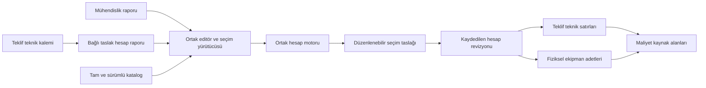

# Hızlı otomatik seçim — uygulama ve doğrulama

Tarih: 09.09.2026 · Başlangıç: `3ed89a4` · Seçim sürümü: `1.0.0` · Hesap motoru: `0.8.0`

**Güncel durum:** Bu belge ilk uygulamanın tarihsel kaydıdır. İkinci denetimdeki dört somut hata giderildi; seçim 1.1.0, ek fazların değişiklikleri, 68 başarılı kontrol ve açık mühendislik kapsamı [tamamlama kaydındadır](HIZLI_OTOMATIK_SECIM_TAMAMLAMA_DURUMU.md).

Teknik özelliklerden başlayan, marka tercihlerine göre bağlı ekipman seçen ve sonucu düzenlenebilir rapora uygulayan özellik geliştirildi. Mühendislik raporu ve teklif içindeki ön hesap aynı editörü, aynı hesap motorunu ve aynı seçim yürütücüsünü kullanır. İki veritabanı migrasyonu uygulandı. Uygulama kodu çalışma ağacındadır; bu çalışma kapsamında Vercel yayını yapılmadı.

Bu belge, [ilk araştırma planının](HIZLI_OTOMATIK_SECIM_PLANI.md) uygulama sonucudur. Planın bütün mühendislik çıkış ölçütlerinin kapandığı anlamına gelmez: kaynaklı üretici verisi, onaylı imalat profili ve bağımsız mühendislik kabulü gerektiren maddeler aşağıda açıkça ayrılmıştır. Sistem bunları uydurarak yeşil sonuca dönüştürmez.

## Kullanım

1. Mühendislik veya teklif hesap raporunda **Teknik Özellikler** başlığının yanındaki **Hızlı otomatik seçim** düğmesine basılır.
2. Motor, kaldırma/yürütme redüktörü, servis/yürütme freni, motor/teker kaplini, tambur kaplini, rulman, halat ve tampon markaları seçilir. Boş bırakılan marka için uygun katalog markaları değerlendirilir. Son marka tercihleri tarayıcıda hatırlanır.
3. İstenirse mevcut ekipmanlar, ölçüler veya bütün bir bölüm kilitlenir. Ölçü adayları ve ana kirişle birlikte buruşma/başkiriş değerlendirmesi ayrı seçeneklerdir.
4. **Hesap raporunu oluştur** bir kez çalıştırır. İlerleme gösterilir; iptal edilen işlem raporu değiştirmez. Tamamlanan taslak tek seferde uygulanır.
5. Seçilen ürünün ayrıntısı, son bağlı hesaptaki hesaplanan/sınır değerlerini ve motorun sağladığı standart referanslarını gösterir. Kalan seçimler, eksik üretici verisi ve ölçü teyitleri ayrıca listelenir.
6. Kullanıcı raporu düzenler ve **Kaydet** ile saklar. **Son hızlı seçimi geri al**, otomatik işlemden sonra elle değiştirilmiş alanları korur.

Teklif kaleminde **Hızlı hesap raporu**, teknik tablodan bağlı bir taslak açar. Teklif önce mevcut kayıt akışıyla kaydedilir; aynı kalemde tekrar açılması ikinci hesap oluşturmaz. Ortak editörde seçim yapılıp rapor kaydedildikten sonra **Kaydedilmiş seçimleri teklif tablosuna aktar** kullanılır. Sonradan **Hesaptan teknik bilgileri güncelle** ile yeniden aktarılabilir. Manuel veya müşteri kapsamındaki satırlar korunur; korunan satırlar kullanıcıya bildirilir.

## Fazların teslim durumu

| Faz | Uygulanan | Açık kalan mühendislik/veri sınırı |
|---|---|---|
| 0 — Envanter ve kapsam | Kod, türetme, teklif/maliyet ve katalog denetimleri; açık saha, portal, özel vinç/aparat ve ikinci kiriş kapsam bildirimleri | Bütün özel vinç aileleri için bağımsız normatif doğrulama dosyası oluşturulmuş değildir |
| 1 — Katalog | Canlı 71.539 satırın okunması; tam sayfalama, sürüm denetimi, varyant kimliği, birim/sayı normalizasyonu, ürün sahipliği ve bağlantı filtreleri | Eksik motor çevrimi, termik kapasite, kaplin devri/bağlantı ve ürün kütleleri üretici kaynağı olmadan doldurulmadı |
| 2 — Ortak altyapı | Saf ortak türetme, sonlu sayı kontrolü, kilitler, atomik uygulama, iptal, eski sonuç koruması, geri alma, iz, JSON aktarımı, kayıt çakışması | Küresel optimum garantisi yok; arama sınırları açık |
| 3 — Kaldırma | Halat, tambur/mil/kaynak ölçü adayları, rulman/yatak, motor-redüktör eşleşmesi, servis/emniyet freni, kaplinler, denge rulmanı, kanca bloğu | Her üretici fren ailesi ve mekanik montaj şekli aynı fiziksel zincirle desteklenmez; uygun aday yoksa korunmuş değer eksik seçim olarak işaretlenir |
| 4 — Yürütme | Teker, mil, rulman, motor-redüktör, fren, kaplinler, tampon ve uygulanabilir feston seçimi; gerçek hız ve katalog bağlantı sınırları | Teker adedi, ray ailesi ve gerçek aks/yerleşim ölçüleri mevcut tasarım girdileridir; ray ve tüm düzen alternatifleri üzerinde serbest optimizasyon yok |
| 5 — Ekran | İki bağlamda aynı düğme/popup, marka tercihleri, ayrıntılı gerekçe, kalan işler, iptal ve geri alma; salt okunur koruma | Üretici eksiklerinin insan tarafından kaynakla tamamlanması gerekir |
| 6 — Teklif ve maliyet | İşlemsel kalem-hesap bağı, teknik tablo aktarımı, kaynak revizyon snapshot'ı, fiziksel adet ve birim güç, maliyet kaynak alanları, manuel ezme koruması | Fiyat/teslim süresi optimizasyonu yapılmaz; maliyet tahmini fiziksel hesaba geri beslenmez |
| 7 — Yapı ve kütle | Tambur, mil, kanca, ana kiriş/başkiriş ölçü adayları; etkin buruşma kontrolü; en fazla dört tur kütle-ekipman-yapı değerlendirmesi | Eksiksiz kaynaklı kütle yoksa teknik özellikteki kütle korunur. Tam imalat yerleşimi, erişilebilirlik, kaynak birleşimi ve onaylı ölçü profili üretildiği iddia edilmez |
| 8 — Ek kapsam | Etkin yardımcı/monoray/ayrı araba gruplarında aynı seçici; ikiz/çift tambur fiziksel adetlerinin korunması; isteğe bağlı elektrik sürücü/kablo ve klima seçimi | İkinci kirişin bağımsız burkulması, portal ayak/stabilite, rüzgâr/ankraj/devrilme, özel hizmet ve bütün eşzamanlı yük senaryoları tamamlanmış değildir |
| 9 — Doğrulama ve işletim | Birim/entegrasyon testleri, gerçek katalog pilotları, RLS/tekrar güvenliği, katalog tetikleyicisi, derleme, görsel kontroller, kapatma anahtarı | Mühendisin gerçek proje ve üretici verisiyle bağımsız kabulü yazılım testi yerine geçirilmedi. Vercel yayını yapılmadı |

## Seçim yöntemi ve değişmezler

- Fiziksel formüller `runCalc` içindedir. Editörden çıkarılan `src/lib/calc/state.ts` saf türetmelerini manuel editör ve seçici birlikte çağırır. İkinci bir güç, tork, gerilme veya yük hesabı yazılmadı.
- Arama dört uygun dalı korur; bir mekanik turda 18.000 değerlendirme bütçesi vardır. Kütle geri beslemesi en fazla dört turdur. Tekrar eden veya yakınsamayan kütlede son hesaplanmış tutarlı taslak korunur.
- Önce katalog yeterliliği ve fiziksel eşleşme, sonra ortak motor kontrolleri uygulanır. Gerçek motor devri kullanılır. Motor-redüktör birlikte denenir; hedef hız için ±%5 firma toleransı uygulanır. Bu tolerans bir standart hükmü olarak sunulmaz.
- Uygun dalların sıralaması düşük motor gücü, boyut ve ürün ağırlığına ilişkin basit tercihler içerir. Arama sınırlıdır; fiyat, stok, tedarik süresi veya küresel minimum garantisi yoktur.
- Aynı marka/modelin farklı oran, devir, mil veya kapasite satırları ayrı varyanttır. Katalogdaki satır sırası sonucu değiştirmez. `unverified: true` satırları kullanılmaz.
- Ürün değişince o ürüne ait eski kapasite/ölçü alanları temizlenir; yeni üründe bilinmeyen alan `null` olur. Eski motor milini yeni motora taşıyan hibrit ürün oluşmaz.
- Rulman/mil ve rulman/yatak eşleşmesi yalnız “daha büyük kapasite” mantığıyla yapılmaz. Tam bağlantı ölçüsü, aile, marka ve katalog uyumu ayrı süzülür. Tampon ve fren aileleri teknik özelliklerdeki fiziksel tipe uyar.
- Fiziksel adetler ve insanın ölçü teyitleri otomatik değiştirilmez. Gizlenmiş rapor bölümleri fiziksel kütle hesabından parça düşürmez; hesap kapsamını kapalı modüller belirler.
- Tam olmayan kütle dökümünün alt toplamı tasarım kütlesi sayılmaz. Yalnız tam bantlarda katalog aralığının üst ucu kullanılır ve kütle tekrar hesaba sokulur. Mevcut firma tahminleri ayrıca görünür.
- Kullanıcının başlatması yalnız o işlem için yetkidir. Sonraki teknik değişikliklerde ürünler arka planda kendiliğinden yeniden seçilmez.

## Sonuç, kayıt ve yetki

`SelectionTrace`, seçim ve hesap sürümlerini, katalog hash'ini, istek/sonuç hash'lerini, marka/kilitleri, seçilen tam katalog satırını, kontrol değerlerini ve eksikleri saklar. Hash'ler yerel değişiklik/iz kimliğidir; kriptografik imza değildir.

İşlem sürerken rapor değişirse eski sonuç uygulanmaz. Kullanıcı kayıt isteği sürerken düzenlemeye devam ettiyse yeni değişiklikler kaydedilmiş sayılmaz. Sunucu, düzenleme anındaki `updated_at` sürümünü ve taslak durumunu hem okumada hem yazmada denetler. Aynı raporu başka sekmede değiştiren kullanıcı sessizce ezilmez.

Seçim izi bulunan raporu yayımlarken sunucu yeniden hesaplar. Engelleyici kontrollerin hem geçmesi hem sayılarının sonlu olması gerekir. Eksik üretici/kapsam verisi için kaynaklı mühendis kontrol notları güncel hesapla ilişkilendirilir. Notlar başarısız sayısal kontrolü geçerli yapmaz. Hesap değiştiğinde ilişkilendirme geçersiz olur. Dosyayla dışa/içe aktarım seçim izini taşır, eski raporun kontrol onayını taşımaz.

Katalog uç noktası her çağrıda oturumu, rolü, revizyon erişimini, taslak durumunu ve rapor bağlamını doğrular. İlk indirme 1.000 satırlık sayfalarda, dört paralel sayfayla yapılır. Toplam/sürüm/satır kimliği tutarsızsa seçim başlamaz. Aynı tarayıcı oturumunda katalog paylaşılır; her yeni çalıştırmada sürüm ve yetki yeniden doğrulanır. HTTP yanıtları `no-store` döner.

`AUTO_SELECTION_ENABLED=false` sunucuda yeni canlı otomatik çalışmayı kapatır. Mevcut raporlar ve manuel düzenleme yolu korunur. Önizleme fikstürü yalnız geliştirme ortamında açıktır.

## Teklif ve maliyet veri akışı



Teklif teknik parser'ı belirsiz kapasite metnini sayı sanmaz. Çift hızlı hücrede üst çalışma hızı açık bir kuralla alınır ve not düşülür. Manuel metnin arkasında kalmış eski `parts` değerleri kullanılmaz. Mekanizma sınıfı kapasiteden tahmin edilmez; bulunmayan teknik değerlerin başlangıç kabulleri raporda görünür.

Motor gücü birim kW olarak, adet fiziksel BOM'dan ayrı taşınır. İkiz donanım toplamı ikinci kez çarpılmaz. Teknik koşulları sağlamayan veya seçimi tamamlanmayan şablon ürün teklife başarılı yeni seçim gibi aktarılmaz. Yeniden aktarımda eski otomatik değer silinirken manuel satır korunur. Maliyet alanları kaynak revizyon/hash bilgisini taşır; kullanıcının ticari ezmeleri değişmez.

## Doğrulama kanıtları

### Gerçek katalog pilotu

Veri: 71.539 canlı katalog satırının salt okunur snapshot'ı. Girdi: 10 t, 20 m açıklık, 10 m kaldırma, 4 m/dak, M6; ana kanca, araba, köprü, teker yükleri, ana kiriş, buruşma ve başkiriş birlikte etkin.

| Senaryo | Süre | Değerlendirme | Ekipman seçimi | Son hesapta engelleyici maddeler |
|---|---:|---:|---:|---|
| Varsayılan Manyetik Fren | 8.116 ms | 5.140 | 28 | Teker düzeni ve ana kiriş yük ölçüsü için iki insan teyidi |
| Eldro Fren | 6.857 ms | 5.148 | 29 | Aynı iki insan teyidi |

Manyetik kaldırma freni, mevcut katalog/model zincirinde uygun aday bulunmadığı için Eldro'ya çevrilmedi. İkinci senaryoda kullanıcı Eldro tercihi verdiği için kasnaklı servis freni seçildi. Motor görev çevrimi, bazı kaplin devirleri, termik kapasite ve eksik kütleler ayrı veri eksikleri olarak kaldı. İki sonuç da `incomplete` durumundadır; “tam mühendislik onayı” olarak sunulmaz.

Süreler bu makinedeki iki pilotun hesap/aday araması süresidir; ilk katalog indirimi ve ağ gecikmesi dâhil değildir. Ham katalog snapshot'ı yaklaşık 34,7 MB'dır ve tarayıcı oturumunda tekrar kullanılır. Bunlar P95, bütün tonajlar veya bütün markalar için performans garantisi değildir. 28 satırlık küçük geliştirme fikstüründe ek katalog eksikleri nedeniyle arayüzde 25 seçim çıkması beklenir. Bu fikstür bağımsız doğrulanmış mühendislik referans vakası değildir.

### Otomatik ve görsel testler

- Son ilgili regresyon paketi: **97 başarılı, 0 başarısız**, gerçek katalog isteyen **2 test normal koşuda atlanır**. Bu iki test ayrıca katalog snapshot'ıyla çalıştırıldı ve geçti; o kataloglu özellik koşusunun toplamı **30 başarılı, 0 başarısız**.
- Ürün sahipliği, varyant ayrımı, boş/sonsuz veri, marka/fiziksel aile uyumu, bölüm/alan kilidi, katalog sırası determinismi, son hesaba bağlı gerekçe, kütle eksikliği ve ölçü teyidi koruması sınandı.
- Elektrik önerisinin sabit seçime dönmesi ve kilit korunması; teklif/maliyet aktarımı, ikiz fiziksel adetler, manuel ezme koruması, kaynak JSON bütünlüğü, dışa/içe aktarım ve güncel hesapla not ilişkisi sınandı.
- Sunucu kayıt sürümü çakışması, okuma-yazma yarışı, bağlama göre rol, bozuk seçim iziyle yayımlamanın engellenmesi ve katalog uç noktasının erişim/sürüm/paginasyon korumaları sınandı.
- Tarayıcıda marka popup'ı, gerçek Web Worker sonucu, hesap gerekçesi, başlatıp iptal, iptalde raporun değişmemesi, açıklığı sonradan 21 m yapıp geri alınca 21 m'nin korunması ve salt okunur teklif raporunda düğmenin bulunmaması doğrulandı. Geliştirme sürecinde 390 px görünüm incelendi; yatay taşma görülmedi.
- Tam mevcut test paketi de çalıştırıldı: ilk turda 3.789 test geçti. Yeni metadata alanlarının aktarım kapsam listesi düzeltildi. PDF testi yalnız toplu koşuda zaman aşımına uğradı; tek başına tekrar geçti.
- Kalan **üç mevcut test hatası**, değişikliksiz `3ed89a4` kaynak arşivinde de aynı şekilde yeniden üretildi: Excel çizim özetindeki iki eski başlık beklentisi ve kaynak kütlesi eksik Esit yük hücresinin pozitif ağırlık beklentisi. Bu özellik için uydurma ağırlık veya ilgisiz etiket değişikliği yapılmadı.
- Üretim derlemesi başarıyla çalıştırıldı. Derleme fontları ağ erişimi gerektirdiği için izinli ağ ortamında doğrulandı. Son derleme ve test çıktıları yerel `tmp/auto-selection/` dizinindedir.

### Veritabanı

Uygulanan migrasyonlar:

- `20260908000011_auto_selection.sql`: sürümlü katalog durumu, teklif kalemi-hesap bağlantısı, RLS ve tekrar güvenli oluşturma RPC'si.
- `20260909000001_auto_selection_rpc_privileges.sql`: anonim RPC çağrısını ve katalog sürüm fonksiyonunun doğrudan çağrısını daraltan yetkiler.

Canlı denetimde bağlantı tablolarında RLS açık, oluşturma RPC'si `SECURITY INVOKER`, anonim EXECUTE kapalı ve authenticated EXECUTE açık bulundu. RPC erişilebilir taslak teklif kalemini ve kullanıcı rolünü denetler; RLS'yi aşmaz.

Geri alınan canlı işlem testinde aynı kaleme iki çağrı **tek proje, tek revizyon ve tek bağlantı** üretti. Mühendis rolünün teklif bağlamına yazması reddedildi. Katalog satırına geri alınan değişiklik sürüm tetikleyicisini artırdı. Test sonunda **ROLLBACK** yapıldı; test proje/rapor/teklif/katalog değişiklikleri kalıcılaştırılmadı.

## Bakım ve yeniden doğrulama

```powershell
npm test -- src/lib/auto-selection src/app/api/auto-selection
node scripts/auto-selection-db.mjs inspect
node scripts/auto-selection-db.mjs catalog
$env:AUTO_SELECTION_CATALOG_FILE = 'tmp/auto-selection/catalog.json'
npm test -- src/lib/auto-selection/__tests__/catalog-validation.test.ts
node scripts/auto-selection-db.mjs query scripts/inspect-auto-selection-db.sql
node scripts/auto-selection-db.mjs query scripts/verify-auto-selection-db.sql
npm run build
```

DB betiği bağlantıyı mevcut ortamdan/env dosyalarından okur. Anahtarlar kaynak koda veya bu belgeye yazılmaz. `verify-auto-selection-db.sql` yönetim bağlantısında geçici fixture kurar ve bütün değişiklikleri geri alır. `migrate` komutu yalnız henüz uygulanmamış yeni migration içindir; uygulanmış iki migration yeniden çalıştırılmaz.

Katalogda veri tamamlama yapılırken her üretici alanının kaynağı korunmalı; yalnız bir testin yeşil olması için kapasite yazılmamalı. Yeni fiziksel hesap gerektiğinde ortak motor ve kaynak standart birlikte güncellenmeli. Yeni destek ailesi, küçük aday evreni ve gerçek üretici vakalarıyla ayrıca doğrulanmalı. Tam imalat profili, ikinci kiriş burkulması ve açık saha stabilitesi bu sürümün doğrulanmış kapsamına dâhil edilmemelidir.

## Dosya haritası

| Alan | Başlıca dosyalar |
|---|---|
| Ortak türetme | `src/lib/calc/state.ts`, `src/lib/calc/presentation/module-family.ts` |
| Seçim çekirdeği | `src/lib/auto-selection/{solver,orchestrator,catalog,compatibility,preflight,scope,electrical}.ts` |
| İşlem ve kayıt izi | `types.ts`, `trace.ts`, `undo.ts`, `selection.worker.ts` |
| Ortak arayüz | `src/components/auto-selection-{dialog,decisions,review}.tsx`, ortak `revision-editor.tsx` |
| Katalog servisi | `src/app/api/auto-selection/catalog/route.ts` |
| Teklif bağlantısı | `src/app/(app)/offers/calculation-actions.ts`, `src/components/offer-calculation.tsx` |
| Teknik/maliyet aktarımı | `src/lib/auto-selection/offer-{bridge,source}.ts`, `src/lib/offers/cost/report-source.ts` |
| Kayıt ve aktarım | Revizyon `actions.ts`, `src/lib/offer-report-transfer.ts`, `src/lib/revision-{load,diff}.ts` |
| Görsel önizleme | `/dev/auto-selection-preview`, `?readonly=1&context=offer` |

İlk araştırma dayanakları: [hesap motoru denetimi](AUTO_SELECTION_ENGINE_AUDIT.md), [entegrasyon denetimi](AUTO_SELECTION_INTEGRATION_AUDIT.md), [katalog denetimi](AUTO_SELECTION_CATALOG_AUDIT.md). Bu eklerdeki satır numaraları başlangıç sürümüne aittir.
