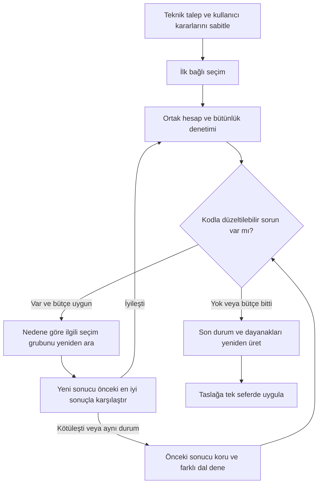

# YRTYR — hızlı seçim denetimi ve otomatik düzeltme planı

10.09.2026 · İlk inceleme ve ardından onaylanan uygulama. Bölüm 1–7 ilk denetimin tarihsel bulgularıdır. Kullanıcı daha sonra tüm fazların uygulanmasını ve standart 1500 dev/dak / yakın katalog devri için ±%10 kabulünü onayladı. Uygulama durumu dosyanın sonundadır. Özgün canlı rapor karşılaştırma için korunur.

## 1. İncelenen örnek ve kanıt sınırı

Teklif bağlamındaki `YRTYR · 100T X 50M VİNÇ`, V0 taslak incelendi. Son kayıt 10.09.2026 08:18:21 Türkiye saati, hızlı seçim 08:15:38. Seçici 1.2.0, hesap motoru 0.9.0; yerel motor da 0.9.0.

- 100 t, 50 m açıklık; kaldırma 16 m / 8 m/dak, araba 50 m/dak, köprü 100 m/dak.
- M6/T6; azami ortam sıcaklığı 50 °C; ana araba 20 t, köprü 100 t girilmiş.
- Halat donanımı 2/12. Araba 4 teker / 2 tahrik / 50×50 ray; köprü 8 teker / 4 tahrik / A75 ray.
- Firma markaları ve H / DR / APC-AT / J serileri kullanılmış; kilit yok.
- Ana kaldırma, kanca, araba, köprü, teker yükleri, ana kiriş, buruşma ve başkiriş etkin. Elektrik hesabı kapalı; bu nedenle sürücü/kablo hesabı yapılmaması bu örnekte eksik seçim değildir.

Kaydedilmiş ham girdilerin/seçimlerin hash'i seçim sonucundaki hash ile birebir eşleşti. Kullanıcının seçim sonrasında değiştirmediği beyanı kayıtla doğrulandı. Aynı kaydı ortak yükleyici ve `runCalc` ile hesaplayınca kaydedilmiş sonuçlarla fark bulunmadı. Ancak ilk çalıştırma öncesinin bütün girdi snapshot'ı saklanmadığından ilk aramanın her adayını geriye dönük birebir yeniden kurmak mümkün değil. İkinci deney, kaydedilmiş son taslağı aynı tercihlerle tekrar çalıştırmadır.

Yerel kanıtlar `tmp/auto-selection/yrtyr-audit/` içinde, git dışında saklanır. Token bu dosyaya veya kaynak koda yazılmadı. Eşzamanlı diğer çalışma dosyalarına dokunulmadı.

## 2. Sistem bu raporda ne yaptı?

4.819 hesap değerlendirmesi sonunda 25 katalog kararı üretti ve durumu doğru biçimde `incomplete` bıraktı. Kontrol motorunda 104 kontrol var: 95'i geçti; 6 sayısal yürütme hatası, 2 insan ölçü teyidi ve 1 kiriş geometrisi uyarısı geçmedi. Seçim izindeki 27 not, ayrıca üretici/katalog verisi ve firma kabullerini içeriyor; 27 bağımsız fiziksel hata anlamına gelmiyor.

Örnek sonuçlar:

| Bölüm | Kaydedilmiş sonuç |
|---|---|
| Halat | HAŞÇELİK Ø24, H 8K PI, 2160 MPa |
| Tambur | Ø500 mm |
| Ana kaldırma motoru | GAMAK 200 kW / 740 dev/dak |
| Ana kaldırma redüktörü | YILMAZ HT1323, i=24,94 |
| Kaldırma freni / motor kaplini | SIBRE TE500/121/6 / APC-AT 500 |
| Tambur kaplini | OZGUN J9 |
| Kanca / makaralar | DIN 15401 Nr 50 / Ø550 mm |
| Araba / köprü tekeri | Ø710 / Ø800 mm |
| Araba / köprü yürütme tahriki | Yeni katalog motoru ve redüktörü seçilememiş |

Ana kaldırma ve kanca seçimleri ortak hesap kontrollerinden geçmiş. Bu, bütün montaj, termik kapasite ve imalat şartlarının onaylandığı anlamına gelmiyor. Sistem üretici eksiklerini ayrıca korumuş.

## 3. Somut eksikler ve nedenleri

### A. Motor–redüktör seçiminde çalışma noktası yanlış daraltılıyor

Aktif katalog ve seçilmiş marka/seri/veri filtrelerinden sonra 138 GAMAK motoru ve 579 DR redüktör varyantı var. Dolayısıyla rapordaki “katalog adayı yok” açıklaması gerçek durumu anlatmıyor.

DR satırlarının referans giriş devri 1450 dev/dak. `solver.ts` motoru yalnız katalog devrinin %90–100 aralığında kabul ediyor. Örneğin yeterli güce sahip 11 kW / 1480 dev/dak GAMAK motoru, 1450'den büyük olduğu için eleniyor. Daha düşük kutuplu/devirli alternatiflerin 725 ve 950 gibi çalışma noktalarına ilişkin güç sütunları veride mevcut; seçici bunları kullanmıyor.

Sabit mevcut teker geometrileriyle tanısal taramada:

- Arabada motor gücü ön elemesini geçen ve hız/oran aralığına giren 725 motor–redüktör çifti devir filtresinde elendi.
- Köprüde aynı noktaya ulaşan 705 çift de devir filtresinde elendi.
- Bu sayılar tam uygun kombinasyon sayısı değildir: sonraki moment, termik kapasite ve bağlantı kontrollerine ulaşamayan çiftlerdir.

Katalog çıkarıcısı `scripts/catalog-extract/extract.py` bu alanı `ref_n1` olarak oluşturuyor; diğer devir güçlerini `nominal_power_kw_n1_*` alanlarında koruyor. Alanın adı/değeri üretici azami giriş devri belgesi yerine kullanılamaz. Çözüm keyfî bir devir toleransı açmak değildir: referans çalışma noktası, çalışma noktasındaki izinli kapasite, motor etiket devri, gerekiyorsa sürücüyle çalışma devri ve gerçek azami devir ayrı modellenmeli. Noktalar arası kullanıma/ekstrapolasyona ancak kaynak izin veriyorsa geçilmeli.

### B. Birleşik aşamanın hata açıklaması yanlış kaynaktan üretiliyor

`drive` iki katalog seçimini birleştiren sanal aşama. Son hata mesajı `candidatesFor(drive)` çağrısıyla yazılıyor; bu aşamanın doğrudan katalog eşlemesi olmadığı için sayı sıfır geliyor. Motor veya redüktör katalogları dolu olsa da “aday yok” yazılabiliyor.

Gereken açıklama örneği: “138 motor / 579 redüktör varyantı bulundu; güç ve oran filtrelerinden geçen çiftler çalışma noktası koşulunda elendi.” Gerçek boş katalog, eksik alan, uyumsuzluk ve arama bütçesi ayrı durumlar olmalı.

### C. Tamamlanmayan tahrikten sonra bağlı ekipmanlar seçiliyor

Tahrik aşaması sonuç bulamazsa önceki şablon değerleri korunuyor; sıradaki fren ve kaplin aşamaları devam ediyor. Bu raporda:

| Grup | Motor hesabının istediği toplam güç | Kalan şablon gücü |
|---|---:|---:|
| Araba | 20,685 kW | 2 × 3 = 6 kW |
| Köprü | 73,072 kW | 4 × 4 = 16 kW |

Her iki redüktörde oran hâlâ otomatik ihtiyaç değeri; gerçek katalog tahvili seçilmemiş. Emniyet katsayıları gereken 1,6'ya karşı yaklaşık 0,147 ve 0,206. Buna rağmen DERELI frenler ve SIBRE APC-AT motor kaplinleri seçilmiş. DR gerçekten seçilebilseydi motor akuple bağlantı nedeniyle harici motor kaplini gerekmeyecekti.

Bu nedenle her ekipmanın yalnız kendi tork kontrolünü geçmesi yeterli değil. “Bağlı tahrik kesinleşti mi?” kontrolü gerekli. Geçici bir motorla hesaplanan fren/kaplin sonuçları geçici olarak işaretlenmeli ve üst seçim değişince zorunlu olarak yeniden hesaplanmalı. Seçim adedi tek başına tamamlanma göstergesi olmamalı.

### D. Kütle–geometri döngüsü eksik kalemde duruyor, tutarsızlık büyüyebiliyor

Mevcut ağırlık modeli şu değerleri verdi:

| Bant | Teknik özellikte kullanılan | Mevcut modelin hesapladığı kısmi toplam | Eksik kalem |
|---|---:|---:|---:|
| Köprü | 100,0 t | 168,562 t | 2 |
| Araba | 20,0 t | 22,551 t | 4 |

Yalnız iki ana kirişin mevcut geometriye dayalı toplamı yaklaşık 151,397 t. Bu rakamlar ölçülmüş gerçek ağırlıklar değildir; geometrik hesap ve firma tahminleri içerir. Yine de mevcut tasarımın kendi içinde 100 t köprü kabulüyle tutarlı olmadığını gösterir.

Mevcut yürütücü eksik kütle varsa teknik özellikteki ağırlığı korur. Bu yaklaşım bilinmeyene sıfır yazmıyor; ancak hesaplanan kısmi toplamın girilmiş ağırlığı aşması için ayrı bir tutarlılık kontrolü yok. Sonraki seçim, teker yükü, motor ve yapı hesabı eski düşük kütleyle kalıyor.

Yeni katmanda katalog/ölçüm ağırlığı, geometriden hesaplanan ağırlık, firma tahmini ve bilinmeyen ayrı taşınmalı. Tahminli kısmi toplam ölçülmüş alt sınır diye adlandırılmamalı. Eksik olmasına rağmen girilmiş kütleyle açık çelişen tasarım tamamlanmış sayılmamalı; değiştirilebilir kütle kabulü ve geometri birlikte yeniden ele alınmalı. Eksik ürünün ağırlığı uydurulmamalı.

### E. Kiriş araması ve tekrar çalıştırma kaliteyi düşürebiliyor

Mevcut kesitte L/b = 156,25; hesap motorunun gösterdiği hedef ≤65. Arama yüksekliği ve plaka kalınlıklarını değiştiriyor; gerekli kutu genişliği değişkenlerini aynı biçimde taramıyor. Üstelik kesit kabulünde yalnız engelleyici kontroller esas alındığından “uyarı” düzeyindeki tasarım hedefleri seçim sıralamasını yeterince etkilemiyor.

Kaydedilmiş taslağı aynı tercihlerle yerelde yeniden çalıştırdım:

- Yürütme eksikleri yine kaldı; karar adedi yine 25.
- Ana gövde yüksekliği 2975 mm'den 2625 mm'ye indi.
- Önce L/δ ≈1195 ile sağlanan ≥1000 sehim hedefi, ikinci sonuçta ≈863,5'e düştü ve sağlanmadı.

Bu deney canlı kayda uygulanmadı. Sonuç, “sonunda yeniden çalıştır” yaklaşımının tek başına yeterli olmadığını gösteriyor. Her tur bütün tasarım hedefleriyle karşılaştırılmalı; iyileştirmeyen veya yeni kabul dışı sonuç üreten aday geri alınmalı. Ölçü adaylarının her tur bir önceki ölçünün katsayısı olarak yeniden türetilmesi yerine kararlı, sürümlü bir aday alanı kullanılmalı.

### F. Kullanıcı değiştirmediği hâlde yeniden açmada değişmiş gibi görünebiliyor

Ham kayıt hash'i seçim iziyle aynı. Ortak yükleyici kapalı elektrik modülüne `mainDutyCyclePct: undefined` ekliyor; mevcut hash fonksiyonu eksik anahtar ile değeri `undefined` olan anahtarı farklı sayıyor. Böylece hesap sonucu hiç değişmediği hâlde editörde “Seçimden sonra rapor değişti” uyarısı üretilebiliyor.

Bu problem gerçek kullanıcı düzeltmeleriyle otomatik türetmeleri ayıracak geri bildirim mekanizması için de giderilmeli. Hash; kayıt, yükleme ve worker sınırlarında aynı kanonik veri sözleşmesine dayanmalı. NaN/Infinity gibi gerçek geçersiz sayılar normalleştirme adıyla gizlenmemeli.

## 4. Önerilen mimari

Kullanıcı akışı aynı kalır: **Hızlı seçim → marka/seri ve tasarım kararları → oluştur → düzenlenebilir rapor**. Yeni tuş veya onay penceresi önerilmiyor. Aynı worker içinde ilerleme metni seçim, denetim, düzeltme ve son kontrol aşamalarını gösterir.

### Denetleyicinin sorumluluğu

Yeni katmanı kurallı, test edilebilir ve izlenebilir kod olarak kurmayı öneriyorum. Fizik formülleri yine `lib/calc` içinde kalır. Denetleyici aynı hesabın son çıktısını okur, bölüm ve ürün bağımlılıklarını denetler, hangi düzeltmenin denenebileceğine karar verir.

Denetim dört tür bulgu üretir:

1. **Düzeltilebilir seçim/ölçü sorunu:** motor yetersiz, mil/rulman uyumsuz, kiriş sehim hedefi dışında. İlgili değişkenler ve yeniden hesaplanacak bağımlılar bellidir.
2. **Veri/model sorunu:** çalışma noktası desteklenmiyor, ürün kapasitesi/ağırlığı eksik. İlgisiz çapları tekrar büyütmek yerine veri nedeni kaydedilir; kaynaklı alternatif varsa o değerlendirilir.
3. **Kullanıcı kararlarıyla çözülemeyen durum:** verilen seri, ray, teker adedi, hız ve sınıf birlikte uygun sonuç üretmiyor. Kararlar korunur; nedeni son raporda açıklanır. Motor gücünü düşürmek veya farklı marka/ray seçmek için koşul sessizce gevşetilmez.
4. **İnsan/üretici teyidi:** ölçü doğrulaması, flanş/adaptör, belgelenmemiş termik/çevrim şartı. Otomatik tekrar bu kalemleri onaylanmış yapmaz.

Her bulgu kontrol kimliği, ilgili bileşenler, gereken/sağlanan değer, birim, veri kaynağı, kök neden ve denenebilir düzeltmeleri taşır. Son notlar ve durum her tur güncel sonuçtan yeniden üretilir. Mevcut yürütücü en sonda tekrar `runCalc` çağırsa da esas olarak seçim kanıtlarını güncelliyor; bu son sonucu genel bir onarım planına dönüştürmüyor.

### Düzeltme döngüsünün kuralları

- Sabitler: kapasite, hız hedefleri, FEM/ISO sınıfları, marka/seri, halat donanımı, ray ve teker/tahrik adedi, kullanıcı kilitleri. Hız toleransı veya standardın kabul sınırları çözüm çıkarmak için büyütülmez.
- Değişkenler: seçilmesine izin verilmiş katalog modeli, motor gücü, gerçek oran, uygun çaplar, mil/rulman/geometri, açık ölçü önerisi kapsamındaki kesit ve firma kabulleri.
- Bağlı grup örnekleri: halat–tambur–kanca; motor–redüktör–fren–kaplin; teker–mil–rulman–yürütme; kesit–kütle–teker yükleri–tahrik.
- Bir üst seçim değişince bağlı alt seçimler geçerliliğini kaybeder ve tekrar doğrulanır. Bağlı grup tamamlanmadan bütün grup seçilmiş gibi sunulmaz.
- Sıralama: önce geçerli/sonlu sonuç ve zorunlu koşullar, sonra tamamlanmış bağlı gruplar, tasarım hedefleri ve marjlar, ardından güç/malzeme gibi karşılaştırılabilir maliyet göstergeleri. Katalog fiyatı yokken “en ucuz ürün” iddiası kurulmaz.
- İlk çözüm + başlangıç önerisi olarak en çok 3 hedefli düzeltme turu. Tek global hesap/zaman bütçesi ve aynı duruma dönüşü yakalayan kanonik hash kullanılır. Kesin süre sınırı YRTYR ve diğer senaryolarla ölçülerek belirlenir.
- En iyi sonuç ayrı saklanır. Yeni engelleyici hata veya daha önce sağlanan tasarım hedefinde bozulma üreten aday otomatik kabul edilmez. Yakınsama olmazsa en iyi tutarlı kısmi taslak ve açık neden döner.
- Son doğrulama; güncel hesap, katalog kimliği, çalışma noktası, kullanıcı koşulları, kütle tutarlılığı ve seçim izini birlikte kapsar. Sonuç taslağa bir kez uygulanır; iptal ve eşzamanlı kullanıcı düzenlemesi korunur.

## 5. Uygulama fazları ve kabul ölçütleri

| Faz | Yapılacak iş | Tamamlanma ölçütü |
|---|---|---|
| 0 — Kanıtı sabitle | Bu YRTYR girdilerini, ilgili katalog varyantlarını, motor/sürüm ve beklenen bulguları anonim regresyon örneğine dönüştür. İlk çalıştırma kaynak snapshot sözleşmesini tanımla. | Aynı girdide kök nedenler tekrar üretilebiliyor; canlı rapor değişmiyor. Bu tur salt okunur denetim kısmı tamamlandı. |
| 1 — Eleme ve veri modeli | Motor–redüktör aşamasına gerçek aday/ret nedenleri ekle. Referans devir, desteklenen performans noktaları ve azami devir ayrımını kur; üretici kaynağı olmayan ölçeklemeyi kapalı tut. Hash normalizasyonunu düzelt. | YRTYR “katalog boş” diye yanlış açıklanmıyor. Destekli çalışma noktası doğru değerlendirilirken belgesiz nokta açık kalıyor. Aç/kaydet/yükle anlamsız değişiklik üretmiyor. |
| 2 — Sonuç denetleyicisi | Kontrol sonuçlarını, ekipman kökenini, bağlı grup tamamlanmasını ve kapsam eksiklerini sınıflandır. Son durum/notlar tek değerlendirmeden üretilecek. | Tahrik seçilmemişken fren/kaplin kesinleşmiş sayılmıyor. Varsayılan değer “katalog seçimi” olarak gösterilmiyor. |
| 3 — Hedefli yeniden seçim | Hata→değişken→bağımlı grup haritası, yerel yeniden arama, en iyi sonucu koruma, çevrim algılama ve ortak bütçe ekle. | Aynı tuş akışında düzeltilebilir sorun otomatik çözülüyor; yeni hata oluşursa önceki iyi sonuç geri geliyor. Aynı durumda sonsuz tekrar yok. |
| 4 — Geometri ve kütle kapanışı | Kiriş genişlik/yükseklik/kalınlık alanını birlikte değerlendir; sehim ve geometrik tasarım hedeflerini seçim kalitesine dahil et. Kütle sınıfları ve tutarlılık kontrolünü döngüye bağla. | YRTYR'deki 100 t kabulü ile mevcut modelin 168,6 t kısmi toplamı sessizce birlikte kalmıyor. Tekrarda ≥1000 sehim hedefi kaybedilmiyor. Eksik kütle sıfır veya belgeli değer yapılmıyor. |
| 5 — Otomatik geri bildirim kaydı | `autoSelection` izine giriş/sonuç sürümü, denetim bulguları, her turun değişikliği, kabul/geri alma nedeni ve kalan bağımlılıklar ekle. Mevcut ilerleme/sonuç alanında kısa özet göster. | Yeni buton yok. Mühendislik ve teklif aynı döngüyü kullanıyor. Kayıt/yükleme/kopya/teklif aktarımı iz ve belirsizlikleri koruyor. |
| 6 — Kabul ve kademeli açılış | YRTYR, küçük/orta vinçler, yüksek hız/sıcaklık, farklı donanım ve kilitler, eksik katalog, iptal ve kayıt yarışını sınayan matris kur. Eski-yeni seçiciyi aynı girişte karşılaştır. | Hatalı “tamamlandı” sonucu yok; kullanıcı koşulları korunuyor; önce geçen hedefler bozulmuyor; süre/bütçe ölçülmüş; referans mühendis örnekleriyle sonuçlar doğrulanmış. |

Faz 1–4 doğruluk çekirdeğidir; 5 izlenebilirlik, 6 güvenle açılış içindir. Bütün vinç türlerinde uygun ürün bulunması kabul şartı olamaz; veri veya koşul yetersizliğini doğru açıklamak da başarılı davranıştır. YRTYR'nin yürütmesi ancak gerçek çalışma noktası/bağlantı kanıtı ve bütün güncel yük kontrolleri sağlanırsa tamamlanmış sayılmalıdır.

## 6. Zamanla güçlenmesi nasıl sağlanmalı?

İki ayrı geri bildirim kullanılmalı:

- **Aynı çalışmanın içindeki geri besleme:** denetle → neden belirle → hedefli düzelt → karşılaştır. Tamamen otomatik ve kullanıcıya yeni işlem yüklemiyor.
- **Çalışmalar arasında kalıcı iyileştirme:** her tekrar eden başarısızlık türü test örneğine dönüşür. Sonradan yapılan kullanıcı düzenlemeleri, mevcut kaydetme akışından alan/değer farkı olarak izlenebilir; otomatik türetme ile insan düzenlemesi ayrılmalıdır. Bir değişikliğin yapılmış olması onun mühendislik bakımından doğru olduğunu kanıtlamaz. Firma profiline veya üretici kapasitesine ancak doğrulanmış, sürümlü kural olarak girer.

İzler en sık elenme nedenlerini, hangi serilerde veri eksiği bulunduğunu, hangi düzeltmenin kaç turda işe yaradığını ve hangi varsayımların kullanıcı tarafından sık değiştirildiğini gösterir. Böylece “kendini geliştirme”, doğrulanmamış katsayıları sessizce değiştirmek yerine ölçülebilir katalog/model/test iyileştirmesi olur.

Başlıca ölçüler: tamamlanan bağlı gruplar, kalan gerçek sayısal hatalar, üretici/veri eksiği, başlangıca göre çözülen hata, yeni bozulan hedef (hedef 0), tekrar/cycle sayısı, değiştirilen kullanıcı sabiti (hedef 0), kullanıcı sonrası düzeltme oranı ve p50/p95 süre. Sadece seçilmiş ekipman sayısı veya toplam not sayısının azalması doğruluk ölçüsü yapılmamalı.

## 7. Önerilen karar

Bu katmanı kurmak yerinde. Önce YRTYR'nin gösterdiği çalışma noktası, kütle tutarlılığı ve hedefi koruyan yeniden arama eksikleri giderilmeli; ardından bunlar son kontrol döngüsünün kuralları olmalı. Aynı kodu birkaç kez çalıştıran genel bir tekrar mekanizması bu örnekte başarısızlığı tekrar ediyor ve yeni sehim sorunu üretebiliyor.

İlk araştırmada önerilen öncelik sırası Faz 1 → 2 → 3 → 4 → 5 → 6 idi. Kullanıcı devamında bütün fazları onayladı; uygulama ve kabul sonuçları Bölüm 8'de kaydedildi.

## Kaynak dosyalar ve deneyler

- `src/lib/auto-selection/solver.ts`: aşama sırası, `candidatesFor`, devir filtresi, bağlı aday denemesi, kesit kabulü ve sonuç sıralaması.
- `src/lib/auto-selection/orchestrator.ts`: en çok dört kütle turu, eksik bantta eski kütlenin korunması, son hesap ve kanıt güncellemesi.
- `scripts/catalog-extract/extract.py`: referans n1 ve diğer nominal güç sütunlarının kaynağı.
- `src/lib/auto-selection/design-profile.ts`: göreli kesit adayları ve mevcut ölçü serisi.
- `src/lib/calc/modules/travelGroup.ts`, `mainGirder.ts`: verilen sayısal sonuçları üreten ortak hesaplar; bu denetimde yeni fizik formülü yazılmadı.
- `src/lib/weights/topla.ts`: kütle dökümü ve eksik kalemler.
- `src/lib/auto-selection/offer-bridge.ts`: motor/redüktörün kendi kontrolleri tamamlanmadan teklif teknik satırına aktarılmasını sınırlar; bağlı fren/grup bütünlüğü ayrıca güçlendirilmeli.
- `src/lib/auto-selection/types.ts`, `src/lib/revision-load.ts`, revizyon editörü: kayıt ve değişiklik hash'i.
- Yerel `analysis.json`, `consistency.json`, `replay.json`, `replay-check.json`: gerçek rapor hesapları, aday eleme sayıları, kaydetme/yükleme eşitliği ve tekrar seçiminin sonuçları. İlk girdiler ve katalog dump'ı git kapsamı dışındadır.

## 8. Onaylanan uygulama — seçici 1.3.0

Faz 0–5 uygulandı; Faz 6'nın kabul sonuçları aşağıda kaydedilir. Özgün YRTYR kaydı üzerinde kayıt/güncelleme yapılmadı. Teknik örnek müşteri, proje ve revizyon kimliklerinden arındırılarak `crane-100t-50m.json` dosyasına alındı; 149 gerçek katalog varyantından oluşan küçük regresyon kataloğu eklendi. Tam aktif katalog yerelde ve git dışında kaldı.

### Karar değişikliği: motor devri

Kullanıcının 10.09.2026 talebi doğrultusunda yeni motor araması 1500 dev/dak sınıfına ±%10 ile sınırlandı. 1420/1450/1475/1480/1490 gibi gerçek etiket devirleri değiştirilmeden kullanılır. Redüktör referans n1 noktasıyla eşleştirmede de ±%10 firma kabulü uygulanır. Açık üretici azami giriş devri varsa yine aşılmaz. Katalog momenti veya gücü farklı devir için çarpılmaz; farklı düşük devir performans sütunlarından kapasite uydurulmaz. Kilitli mevcut farklı devirdeki motor korunur. Gerçek kaldırma/yürütme hızı önceki ±%5 sınırında ayrıca hesaplanır.

### Fazların karşılığı

| Faz | Uygulanan karşılık |
|---|---|
| 0 | Anonim teknik örnek + gerçek katalog alt kümesi; eski sayısal durum, yeni sonuç ve tekrar çalışma regresyonu. Yeni iz artık başlangıç teknik snapshot'ını da saklar. |
| 1 | Gerçek motor/redüktör aday sayıları; eksik zorunlu veri, besleme, devir sınıfı, güç, tahvil/hız, moment, radyal yük, termik ve bağlantı ret sayıları. JSONB kaydında düşen `undefined` anahtarı hash'i değiştirmez; NaN/Infinity farklı kalır. |
| 2 | `assessment.ts` son hesabı yeniden çalıştırır. Sayısal hata, tasarım hedefi, eksik veri, kullanıcı kilidi ve insan teyidi ayrıdır. Başarısız hesap bulguları gereken/hesaplanan değer, birim ve standardı taşır. Seçim kanıtları son turdan yeniden üretilir. |
| 3 | Aynı worker içinde ilk seçim + üç onarım üst sınırı; soruna bağlı modüller ve alt gruplar yeniden aranır. Ortak 60.000 hesap/120 saniye arama bütçesi, bölüm payı, durum hash'iyle çevrim algılama ve en iyi taslağı geri alma var. Son değerlendirme ve sonuç paketleme küçük ek süredir. |
| 4 | Kiriş araması gerçek gövde aralığı `aMm`, üst/alt flanş genişlikleri, yükseklik ve levha kalınlıklarını birlikte dener. Sehim ve geometrik hedefleri geçenler ortak motorun kg/m çıktısıyla karşılaştırılır. Kütle modeli katalog/hesap/firma tahmini/elle girilen kaynakları ayrı korur. Eksik ürün ağırlığı oluşturulmaz. |
| 5 | `autoSelection.audit` başlangıç durumu, kural/sürüm, katalog hash'i, her denemenin kabul/geri alma nedeni ve kütle kaynaklarını korur. Mevcut popup ve kayıtlı inceleme alanında özet var; yeni eylem düğmesi yok. Teklif ve mühendislik aynı yürütücüyü kullanır. |
| 6 | Gerçek örnek, tekrar, sıralama, kilit, boş katalog, süre bütçesi, JSON kayıt/yükleme, teklif aktarımı, kayıt çakışması ve yayımlama sınırları sınandı; genel test taraması ve üretim derlemesi yapıldı. |

### Kütle karşılaştırmasının önemli ayrıntısı

Yeni tasarımın kütlesi öğrenilince eski tasarımın düşük yükteki yeşil hesabıyla kıyaslama yapılmaz: karşılaştırılan iki tasarım aynı yeni yükte yeniden hesaplanır. Kütle artışı sonucunda açığa çıkan yetersizlik gizlenmez. Açık ölçü önerisi kapsamında tam model hesap kabulüne alınır; eksik model kabulü aşıyorsa yalnız kısmi tasarım kabulü yükseltilir ve eksik/tahmin notu kalır. Kilitli ağırlık değişmez, çelişki açık hata olur. Bütçe veya veri yetmezse eksikleri açıklanan kısmi taslak döner; tam tasarım onayı üretilmez.

### Entegrasyonda yakalanan ek düzeltmeler

- Otomatik feston arabasını sabitlemek yalnız model kimliğini yazıyordu; eski taşıyıcının genişlik/bükülme ölçüleri kalabiliyordu. Seçilen gerçek satırın bütün ölçüleri şimdi birlikte taşınır.
- Geri alınan bir aramadan sonra boş motor sipariş alanları firma kabulleriyle yine tamamlanır; dolu kullanıcı alanı ve kilit korunur.
- Elektrik ana besleme görev çevrimi (`mainDutyCyclePct`) teklif/rapor aktarımında isteğe bağlı sayısal alan olarak tanınır; bilinmeyen çevrim doldurulmaz.
- 1.3.0 rapor yayımlanırken kayıttaki “başarılı” durumuna güvenilmez. Güncel hız, sehim/geometri ve kütle denetimi yeniden çalışır. Elle yapılan gerçek düzeltme yeniden hesaplanabilir; kontrol notu sayısal hatayı geçerli yapmaz.

### Kullanım ve kapsam

Aynı **Hızlı otomatik seçim → tercihler → Hesap raporunu oluştur** akışı sürer. Sonuç bir kez düzenlenebilir taslağa uygulanır; kaydetme, iptal, kaynak değişikliği ve geri alma davranışları korunur. Üretici termik/çevrim, IEC flanş/adaptör, fren enerjisi, eksik ağırlık ve ölçü teyitleri kullanıcı/mühendis kontrolünde kalır.

Bu sürüm doğrulanmamış kullanıcı değişikliklerinden kapasite öğrenmez. Geri bildirim aynı çalışmadaki kurallı denetim/onarım döngüsü ve sonraki geliştirmeler için tekrar üretilebilir kayıt/test örnekleridir. Katalog fiyatı olmadığı için ekonomik küresel optimum iddiası yoktur. Yeni veritabanı şeması gerekmedi: mevcut revizyon JSONB seçim izi, genişletilmiş ve sınırlandırılmış doğrulama şemasıyla kullanılır.

### Faz 6 — gerçek kayıtla son kabul, 10.09.2026

Özgün teknik girdiler ve tam aktif katalogla, gerçek süre sınırı açıkken son çalışma 97.153 ms sürdü. Dört turda toplam 13.316 aday hesabı yapıldı. İkinci ve üçüncü taslaklar kaliteyi artırmadığı için kabul edilmedi; dördüncü turda 12 başlangıç sorunu giderildi. Son denetimde sayısal hata, tasarım hedefi kaybı ve eksik tahrik zinciri kalmadı. Süre cihaz yüküne bağlıdır; bu büyük örnek, 30 saniyelik eski sınırın artırılmasını gerektirdi.

| Grup | Son seçilen motor | Gerçek etiket devri |
|---|---|---|
| Ana kaldırma | 1 × 185 kW GAMAK | 1490 dev/dak |
| Araba yürütme | 2 × 11 kW GAMAK | 1480 dev/dak |
| Köprü yürütme | 4 × 30 kW GAMAK | 1480 dev/dak |

Köprü için hesapta kullanılan tasarım kütlesi 163 t, araba için 23,3 t oldu. Bunlar tartılmış ürün ağırlıkları değildir: katalog, hesap ve firma tahminleri ayrı tutulur; her iki grupta birer eksik ağırlık kalemi görünür. Üretici termik/bağlantı/enerji verileri ve ölçü teyitleri açık kaldığı için rapor otomatik mühendislik onayı almaz. Seçilen kesit de kullanıcının inceleyeceği tasarım önerisidir.

Gerçek katalog kabul matrisinde 15 test geçti. Geniş depo taramasında 3.886 test geçti, iki test başarısız oldu ve 10 test atlandı; bulunan iki entegrasyon eksiği yukarıdaki düzeltmelerle giderildi ve ilgili testler tekrar geçti. Üretim derlemesi, TypeScript ve değişen kodun lint kontrolü başarılı. Geniş taramanın tamamı düzeltmelerden sonra yeniden çalıştırılmadı; son kontrol ilgili hesap seçimi, teklif aktarımı ve kayıt testleriyle yapıldı.

Gerçek revizyon editöründe anonim 100 t örneğiyle popup → worker → otomatik denetim → taslağa uygulama akışı tarayıcıda doğrulandı. Mevcut sonuç alanındaki tur gerekçeleri ve kalan veri notları görüntülendi. Özgün YRTYR kaydı korunarak bütün deneyler yerel kopyada yapıldı.

Son hedefli test çalışmasında 122 test geçti ve harici katalog isteyen 9 test atlandı; kayıt/çakışma testlerinin beşi de ayrıca geçti (toplam 127). Harici katalog kabul testleri yukarıdaki ayrı, gerçek katalog bağlı çalışmada doğrulandı.
